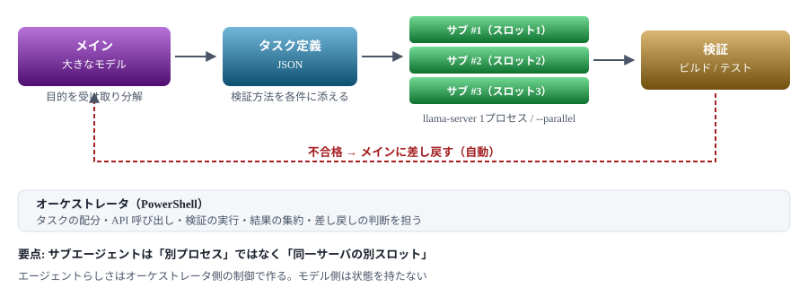

# 階層型エージェント構成案

> 大きなモデルで計画し、小さなモデルで実装する——VRAM 4GB の本PCでその構成が成立するかを設計する
> 📅 作成: 2026-08-25 / 更新: 2026-08-25

← [README に戻る](../../README.md)

## 目次

1. [構想と、それを阻む制約](#1-構想とそれを阻む制約)
2. [同時に何が動くか — VRAM の割り当て](#2-同時に何が動くか--vram-の割り当て)
3. [構成案の比較](#3-構成案の比較)
4. [採用案とアーキテクチャ](#4-採用案とアーキテクチャ)
5. [タスク分解と検証の設計](#5-タスク分解と検証の設計)
6. [段階的な実装計画](#6-段階的な実装計画)
7. [この案が失敗する条件](#7-この案が失敗する条件)

### この文書の位置づけ

「メインの大きなモデルが作業手順を計画し、小さなモデルのサブエージェントを複数使って実装する」という構想を、 [ローカルLLM 実行計画](local-llm-plan.md)で得た実測値の上で設計する。 **結論を先に言えば、構成としては組めるが、本PCでは「複数のサブエージェントを並列に走らせる」部分だけが物理的に成立しない。** その代替と、そもそもこの構成が割に合う条件を整理する。

## 1. 構想と、それを阻む制約

### やりたいこと

1. **メインエージェント（大きなモデル）**が、目的を受け取って作業手順に分解する
2. **サブエージェント（小さなモデル）**が、分解された個々のタスクを実装する
3. サブエージェントは**複数**動かし、量をこなす

狙いは役割分担にある。計画のような「判断が要る仕事」は賢いモデルに、 実装のような「量が要る仕事」は速いモデルに振り分ける。

### 本PCの実測値（計画書 第10章より）

| 項目 | 実測 | この構成にとっての意味 |
| --- | --- | --- |
| 空き VRAM | 3287 MiB | **ここがすべてを決める** |
| Qwen3-4B | 2376 MiB / 56.5 tok/s | サブエージェント候補。速い |
| gemma-4-E4B | GPU 2868 MiB / 45.2 tok/s | メイン候補。思考を経るぶん正確 |
| API 経由の実効速度 | 39.5 tok/s | HTTP 込みの体感値。エージェントはこちらで動く |
| サーバ起動 | 7.5 秒 | モデル切り替えのたびに払うコスト |

### 最初にぶつかる壁

2つのモデルを同時に立てようとすると、**それだけで VRAM を超える**。

| 組み合わせ | 必要 VRAM | 空き 3287 MiB に対して |
| --- | --- | --- |
| Qwen3-4B ×2（サブを2つ） | 約 4752 MiB | **❌ 超過** 1465 MiB 足りない |
| E4B（メイン）＋ 4B（サブ） | 約 5244 MiB | **❌ 超過** 1957 MiB 足りない |
| Qwen3-4B ×1 のみ | 約 2376 MiB | **✅ 収まる** KV と合わせて余裕あり |

> [!NOTE]
> **「小さなモデルを複数」は、モデルを複数プロセス立てることを意味しない。** 本PCで実現するなら、**1つのモデルに複数の会話スロットを持たせる**形になる。 llama.cpp の `--parallel` がそれにあたる。詳細は第2章で扱う。

## 2. 同時に何が動くか — VRAM の割り当て

### 2つの実現方法


### `--parallel` で何が起きるか

| 項目 | 挙動 |
| --- | --- |
| モデルの重み | 1つだけ読み込まれ、全スロットで共有される。**ここが増えないのが利点** |
| KVキャッシュ | `-c` で指定した総量が**スロット数で等分**される |
| スループット | バッチ処理により単発の合計より効率は上がるが、**帯域が共有なので N 倍にはならない** |
| 1タスクあたりの体感 | 同時実行するぶん、個々の応答は遅くなる |

#### コンテキストの割り当て試算

| 設定 | スロット数 | 1スロットあたり | 実装タスクに足りるか |
| --- | --- | --- | --- |
| `-c 8192 --parallel 1` | 1 | 8192 | **✅ 余裕** ただし逐次実行になる |
| `-c 8192 --parallel 2` | 2 | 4096 | **✅ 実用的** 指示＋対象コード＋出力が収まる |
| `-c 8192 --parallel 4` | 4 | 2048 | **⚠️ 窮屈** タスクを相当細かく割る必要がある |
| `-c 8192 --parallel 8` | 8 | 1024 | **❌ 不足** まとまったコードを渡せない |

> [!WARNING]
> **コンテキストを増やして解決はできない。** 計画書 第10章で実測したとおり、`-c 16384` にすると KV が VRAM を超えて **1.30 tok/s まで崩壊する**。8192 が上限である以上、 並列数を上げることは1スロットの余裕を削ることと同義になる。

## 3. 構成案の比較

### 案1 — クラウドで計画、ローカルで実装（逐次）

メインは Claude 等のクラウドモデル。計画を構造化データで出力させ、 オーケストレータがタスクを1つずつローカルの `llama-server` に投げる。

- **✅ 利点** 計画の品質が担保される。分解の妥当性がこの構成の生死を分けるので、ここが強いのは大きい
- **✅ 利点** ローカル側は1モデル1スロットでよく、コンテキスト 8192 をフルに使える
- **⚠️ 欠点** サブエージェントは実質1つ。**「複数」という当初の狙いは満たさない**
- **⚠️ 欠点** 計画フェーズでネットワークとクラウド利用料が要る

### 案2 — 完全ローカル 2段構え（モデル切り替え）

計画は gemma-4-E4B（reasoning・正確）、実装は Qwen3-4B（速い）。 同時常駐できないため、`llama-swap` のようなプロキシか、オーケストレータ自身がプロセスを立て直す。

- **✅ 利点** 完全オフライン。費用がかからない
- **✅ 利点** 計画書 第10章で E4B の正確さは確認済み（Qwen3-4B が誤答した設問に正答）
- **⚠️ 欠点** 切り替えごとに **7.5 秒**。計画↔実装を往復する設計だと効いてくる
- **❌ 欠点** **4B クラスに計画を任せる品質リスク**。E4B でも 7.5B 相当であり、分解の質は未知数

### 案3 — 1モデル＋並列スロット

Qwen3-4B を `--parallel 4` で立て、独立したタスクを同時投入する。

- **✅ 利点** **「複数のサブエージェント」が唯一実現する形**
- **⚠️ 欠点** 1スロット 2048 トークン。タスクを相当細かく割る必要がある
- **⚠️ 欠点** 全サブエージェントが同一モデル。役割ごとにモデルを変えられない
- **⬜ 未知** 並列時の合計スループット。帯域律速なので4倍にはならないが、何倍かは**実測しないと分からない**

### 案4 — ハイブリッド

計画と最終検証はクラウド、実装の量はローカル並列、検証で落ちたタスクだけクラウドに差し戻す。

- **✅ 利点** 各モデルを得意な場所に置ける。**失敗の受け皿がある**
- **✅ 利点** ローカルで捌けた分だけクラウド利用が減る
- **⚠️ 欠点** 構成が最も複雑。オーケストレータの実装量が増える

### 比較表

| 観点 | 案1<br>クラウド計画 | 案2<br>完全ローカル | 案3<br>並列スロット | 案4<br>ハイブリッド |
| --- | --- | --- | --- | --- |
| 計画の品質 | 高 | 中 | — | **高** |
| サブの並列性 | なし | なし | **あり** | **あり** |
| 1タスクの文脈量 | 8192 | 8192 | 2048 | 2048〜4096 |
| オフライン動作 | 不可 | **可** | 可 | 不可 |
| 実装の手間 | 小 | 中 | 小 | 大 |
| 失敗時の回復 | 手動 | 手動 | 手動 | **自動** |

## 4. 採用案とアーキテクチャ

### 採用: 案4（ハイブリッド）を、案3の実測を経て組む

最終形は案4とする。ただし案4の中核は案3（並列スロット）であり、 **そこが何倍のスループットを出すかが分からないまま全体を組むのは順序が逆**。 第6章の段階計画では、案3の実測を最初に置く。

### 全体の流れ



### 各層の責務

| 層 | 担当 | やること | やらせないこと |
| --- | --- | --- | --- |
| メイン | クラウド<br>または E4B | 目的の解釈、タスク分解、検証方法の指定、差し戻しの処理 | 個々の実装。ここで書くなら分解する意味がない |
| サブ | Qwen3-4B<br>並列スロット | 与えられた1タスクの実装。入出力が明確なもの | **設計判断・良し悪しの評価**。4B には荷が重い |
| オーケストレータ | PowerShell | 配分、API 呼び出し、検証コマンド実行、集約、リトライ | 内容の判断。ここは機械的処理に徹する |

### 通信の形

サブエージェントとの通信は、計画書 第10章で動作確認済みの OpenAI 互換エンドポイントを使う。

```text
POST http://127.0.0.1:8080/v1/chat/completions
{
  "messages": [
    { "role": "system", "content": "あなたは与えられた1つのタスクだけを実装します。" },
    { "role": "user",   "content": "<タスク定義>" }
  ],
  "max_tokens": 1024,
  "temperature": 0.2
}
```

サブエージェント側は**状態を持たない**。会話履歴を積まず、1タスク1リクエストで完結させる。 文脈が 2048 トークンしかない以上、履歴を持たせる余裕がないという事情もある。

> [!NOTE]
> **エージェントらしさは、モデルではなくオーケストレータが作る。** 4B に「自律的に考えて動く」ことを期待すると破綻する。 **ループ・分岐・リトライ・検証はすべてコード側に持たせ、モデルには単発の変換だけをさせる**。 この切り分けが、小さなモデルを使う構成が成立するかどうかの分かれ目になる。

## 5. タスク分解と検証の設計

### 4B が扱えるタスクの条件

計画書 第10章の品質評価で、Qwen3-4B は次の結果を出している。

| 設問 | 結果 | この構成への示唆 |
| --- | --- | --- |
| 形式の指示<br>（5項目・各20字） | **✅ 完璧** 指示どおり | **形式が決まった出力は任せられる** |
| コード生成<br>（PowerShell） | **⚠️ 惜しい** 動くが `-Recurse` を落とした | 要件の取りこぼしが起きる。**検証が必須** |
| 知識を問う説明 | **❌ 誤答** 量子化を量子力学と混同 | **知識に依存する判断は任せられない** |

#### タスクの適性

| 適性 | タスクの例 | 理由 |
| --- | --- | --- |
| **✅ 向く** | 定型的な変換、同じ修正の多数ファイルへの適用、テストケースの雛形生成、命名の一括変更 | 正解が機械的に判定でき、判断を含まない |
| **⚠️ 条件付き** | 関数単位の実装（入出力とテストが与えられている場合） | テストが通るかで合否が決まるなら成立する |
| **❌ 向かない** | 設計判断、既存コードの読解を要する修正、「より良く直す」類の指示 | 正解が一つでなく、検証もできない |

### タスク定義に必要な項目

メインが出力するタスク定義には、**検証方法まで含める**。これが無いとオーケストレータが合否を判定できない。

```text
{
  "id": "task-003",
  "goal": "html2md.ps1 の Convert-Table に colspan 展開のテストを追加する",
  "context_files": ["src/scripts/70_html2md/html2md.ps1"],
  "constraints": [
    "既存の関数シグネチャを変えない",
    "PowerShell 5.1 で動作すること"
  ],
  "verify": {
    "command": "pwsh -File tests/run-tests.ps1 -Filter Convert-Table",
    "expect_exit_code": 0
  },
  "max_retry": 2
}
```

### 検証の階層

| 段階 | 内容 | 失敗時 |
| --- | --- | --- |
| 1. 構文 | 生成物がパースできるか。PowerShell なら構文解析、HTML ならタグ対応 | 同じサブに再試行 |
| 2. 静的 | 制約条件を満たすか（禁止パターンを含まない、シグネチャが変わっていない） | 同じサブに再試行 |
| 3. 実行 | `verify.command` を実行して終了コードを見る | 再試行 → 上限でメインへ差し戻し |
| 4. 統合 | 全タスク完了後、全体としてビルド・テストが通るか | メインへ差し戻し |

> [!NOTE]
> **検証を用意できないタスクは、この構成に載せてはいけない。** 4B の出力は「もっともらしく間違える」ことが実測で分かっている。 人間が目視で確認する前提なら、**確認の手間が実装の手間を上回る**。 自動検証が書けるかどうかを、タスク分解時の採否基準にする。

## 6. 段階的な実装計画

### Phase 1 — `--parallel` の実測

**ここが最初に来る。**並列時の合計スループットが分からないまま全体を組むと、 「並列にした意味がなかった」という結論を最後に知ることになる。

| 測る条件 | 見たいこと |
| --- | --- |
| `--parallel 1` で1リクエスト | 基準値。第10章の 39.5 tok/s と一致するか |
| `--parallel 2` で2本同時 | 合計スループットが何倍か |
| `--parallel 4` で4本同時 | 同上。頭打ちの位置を探す |
| 各条件で VRAM | スロット増でどれだけ増えるか |

#### 判断

- **✅ 2倍以上** 並列に意味がある。Phase 2 へ進む
- **⚠️ 1.3〜2倍** 効果は限定的。案1（逐次）でも大差ないので、実装の単純さを取る
- **❌ 1.3倍未満** **並列は諦める**。帯域律速が支配的という結論を記録して終える

### Phase 2 — 単一タスクの往復

オーケストレータの最小形を作り、1タスクを投げて検証まで回す。

- タスク定義 JSON を1件、手で書く
- API に投げ、応答からコードを取り出す
- `verify.command` を実行して合否を出す
- 失敗したら再試行する（最大2回）

ここまでで**「4B が実際にタスクを完了できるか」**が分かる。できないなら以降は無意味になる。

### Phase 3 — 複数タスクの投入

- タスク定義を N 件に増やし、Phase 1 で決めた並列数で投入する
- 成功率を測る。**ここが低いと構成全体が成り立たない**
- 失敗の傾向を分類する（要件の取りこぼし／構文エラー／文脈不足）

### Phase 4 — 計画フェーズの接続

- メインにタスク定義 JSON を生成させる
- 差し戻しの経路を繋ぐ
- 分解の粒度が適切かを、Phase 3 の成功率と突き合わせて調整する

### 成果物の置き場

```text
src/scripts/80_agent/
  orchestrator.ps1     … タスク配分・API 呼び出し・検証・集約
  orchestrator.cmd     … ランチャー
  tasks/               … タスク定義 JSON
  results/             … 実行結果とログ
docs/plan/agent-architecture.html  … 本書
```

> [!NOTE]
> **Phase 1 だけなら、追加のダウンロードも新しいモデルも要らない。** 既にある Qwen3-4B と `llama-server` で測れる。 所要は数十分程度で、その結果が案3の採否を決める。

## 7. この案が失敗する条件

### 失敗のパターン

| 条件 | 何が起きるか | 検知できる段階 |
| --- | --- | --- |
| 並列で速くならない | 帯域律速のため `--parallel` の効果が小さい。逐次と変わらない | Phase 1 |
| 2048 トークンに収まらない | 対象コードを渡しきれず、サブが文脈不足で誤った実装をする | Phase 2 |
| 成功率が低い | 再試行と差し戻しが増え、**人が直した方が速い**状態になる | Phase 3 |
| 分解コストが上回る | タスクを4Bが扱える粒度まで割り、検証まで書く手間が、直接実装する手間を超える | Phase 4 |

### 最大のリスクは4番目

技術的には Phase 1〜3 で解決できる問題が並ぶが、**4番目だけは技術で解決できない**。

4B が扱えるタスクは「入出力が明確で、機械的に検証でき、判断を含まない」ものに限られる。 そこまで細かく分解し、検証コマンドまで用意する作業を誰かがやらねばならない。 **それをメインエージェントにやらせるなら、メインが直接実装するのと手間が変わらない場面が相当ある**。

#### それでも成立する条件

| 条件 | 理由 |
| --- | --- |
| **同種のタスクが大量にある** | 分解の設計コストを1回払えば、N 件に償却できる。**これがこの構成の本命** |
| 検証が既に存在する | テストが揃っているコードベースなら、検証を書く手間が消える |
| クラウド利用を減らしたい | 速度でなく費用が動機なら、逐次実行でも価値がある |
| オフラインで動かす必要がある | 速度・品質より可用性が優先される場合 |

### この計画で決まっていないこと

- **⬜ 未定** **適用する作業内容**。計画書 第9章の時点で常用用途が未定のままであり、 「同種のタスクが大量にある」に当てはまる仕事が具体化していない
- **⬜ 未測定** `--parallel` のスループット。Phase 1 で測る
- **⬜ 未確認** 使用中のビルド（b10612）での `--parallel` の正確なオプション名と挙動
- **⬜ 未検討** メインをクラウドにする場合の接続方法。計画書 第8章 Step 5 と重なる

> [!NOTE]
> **Phase 1 の実測を、適用先が決まる前にやっておく価値はある。** 「並列に意味があるか」は用途に依存しない事実であり、 ここが否定されれば構成そのものを案1（逐次）に単純化できる。 逆に肯定されても、適用する作業が無ければ実装は保留でよい。

### 参考資料

- [ローカルLLM 実行計画](local-llm-plan.md) — 本書が前提とする実測値（VRAM 3287 MiB、Qwen3-4B 56.5 tok/s、API 実効 39.5 tok/s、 品質評価の結果）はすべて第10章による
- [ggml-org/llama.cpp](https://github.com/ggml-org/llama.cpp) — `--parallel` の仕様。**使用中のビルド（b10612）の `--help` を正とする**

> [!NOTE]
> **本書は設計案であり、実装も実測もしていない。** 第2章のコンテキスト割り当て、第6章 Phase 1 のスループット判断基準は、 いずれも実測前の想定である。Phase 1 の結果次第で構成そのものが変わりうる。

---

← [README に戻る](../../README.md)

