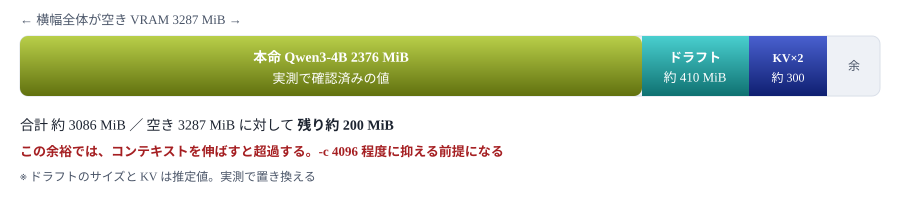

# Speculative Decoding 調査

小さなドラフトモデルで先読みして生成を速める手法が、VRAM 4GB の本PCで成立するかを検討する<br> 📅 作成: 2026-08-25 / 更新: 2026-09-30

[README](../../README.md)

## 目次

1. [調査のきっかけと結論](#1-調査のきっかけと結論)
2. [仕組み — なぜ速くなるのか](#2-仕組み--なぜ速くなるのか)
3. [llama.cpp での使い方](#3-llamacpp-での使い方)
4. [このPCで成立するか — VRAM の見積り](#4-このpcで成立するか--vram-の見積り)
5. [検証計画](#5-検証計画)

## この文書の位置づけ

[ローカルLLM 実行計画](../10_plan/p260824-01-ローカルLLM実行計画.md)の実測（第10章）で、Qwen3-4B は 56.5 tok/s に到達した。 これはGPUのメモリ帯域が決める上限に近い。**帯域を増やさずに、さらに速くする手段はあるか**—— その問いに対する候補が Speculative Decoding である。本書はその成立可能性を検討し、実測した。

## 1. 調査のきっかけと結論

### きっかけ

npaka 氏の記事「Qwen3.8-27Bにおすすめの推論エンジン」（2026-08-23）で、 Speculative Decoding による高速化が目玉として紹介されていた。

| 手法 | 環境 | 効果 |
|---|---|---|
| mlx-dspark | M4 Pro / 8bit | 8.3 → 20.3 tok/s（**2.45倍**） |
| DFlash 2 | H200 / SGLang | GSM8K **3.43倍**、MATH-500 3.34倍 |

ただし記事が扱っていた実装は**いずれも本PCでは使えない**。 mlx-dspark は Apple Silicon 専用、DFlash 2 は SGLang（NVIDIA の大容量GPU向け）専用である。 記事の想定環境も最小で VRAM 24GB と、本PCの6倍以上を前提にしている。

一方で、**Speculative Decoding という手法自体は llama.cpp にも実装がある**。 そこだけを取り出して本PCに適用できないかを調べたのが本書である。

### 結論（実測）

| 論点 | 結果 |
|---|---|
| VRAMに収まるか | ⚠ **ぎりぎり** Qwen3-4B ＋ 0.6B ドラフトで 3925 MiB（4096 MiB 中）。KV を q8_0 にすると 3515 MiB |
| 速くなるか | ❌ **遅くなる** 単体の 57 tok/s に対し、どの構成も 29〜47 tok/s |
| 判断 | ❌ **見送る** 第5章の判断基準の「56 tok/s 未満」に当たる |

記事の 2.45 倍・3.43 倍という数字は、大きなモデルを潤沢なメモリで動かす環境のものである。 本PCの本命は 2.32 GiB と軽く、ドラフトの実行時間を取り返せなかった（第5章の結果）。

## 2. 仕組み — なぜ速くなるのか

### 通常の生成が遅い理由

LLM は1トークンを作るたびに**モデル全体の重みをメモリから読み出す**。 Qwen3-4B なら 2.32 GiB を毎回読む。計算そのものは軽く、**待ち時間の大半はメモリ転送**である。 これが「生成速度はメモリ帯域で決まる」と言われる理由で、実測の 56 tok/s もこの上限に近い。

### 先読みと検証に分ける


### 3つのステップ

1. **先読み** — 小さなドラフトモデルが次の数トークンを一気に推測する。軽いので速い
2. **検証** — 本命モデルが、その推測列を**1回の読み出しでまとめて**検証する
3. **採用** — 先頭から合っている分だけ採用し、外れた時点で本命の答えに差し替える

出力は**通常の生成と完全に一致する**。品質を落として速くする手法ではなく、 「本命モデルが出すはずの答え」を先回りして当てにいく仕組みである。外れても正しさは損なわれず、単に速くならないだけ。

> [!NOTE]
> **効くかどうかは「帯域が余っているか」で決まる。** 本命モデルを1回読む間に複数トークンを確定できるのが利点なので、 **1回の読み出しが遅い環境（＝大きなモデル・広い帯域）ほど得をする**。 逆に本PCのように小さなモデルで帯域を使い切っていると、削れる余地自体が小さい。

## 3. llama.cpp での使い方

### 主なオプション

| オプション | 意味 |
|---|---|
| `-md` / `--model-draft` | ドラフトモデルの GGUF を指定する |
| `--spec-type draft-simple` | ドラフトモデルで先読みする。**b10612 では既定が `none` で、`-md` だけではドラフトを読み込んでも使わない** |
| `-ngld` / `--n-gpu-layers-draft` | ドラフトモデルをGPUに載せる層数。ここを削ると本命に回せる |
| `--spec-draft-n-max` | 一度に先読みするトークン数の上限（既定 3）。大きいほど当たった時の利得が大きく、外れた時の無駄も大きい。b10612 では `--draft-max` は廃止された |
| `--spec-draft-n-min` | 先読みの下限。`--draft-min` は廃止された |
| `--draft-p-min` | ドラフトの確信度がこの値を下回ったら先読みを打ち切る |

### 起動例

```
llama-server.exe ^
  -m  "C:\AI_Models\qwen\Qwen3-4B-Instruct-2507-GGUF\Qwen3-4B-Instruct-2507-Q4_K_M.gguf" ^
  -md "C:\AI_Models\qwen\Qwen3-0.6B-GGUF\Qwen3-0.6B-Q4_K_M.gguf" ^
  -ngl 99 ^
  -ngld 99 ^
  --spec-type draft-simple ^
  --spec-draft-n-max 4 ^
  -c 4096 ^
  --host 127.0.0.1 --port 8080
```

### 成立の前提条件

| 条件 | 内容 | 本PCでの充足 |
|---|---|---|
| 語彙の一致 | ドラフトと本命の**トークナイザが互換**である必要がある。異なる系列のモデルは組み合わせられない | ✅ **満たせる** Qwen3 系で揃える |
| 両方をメモリに載せる | ドラフトと本命の**両方**が同時に必要。KVキャッシュも2つ分要る | ⚠ **ぎりぎり** 第4章で見積る |
| ドラフトが十分速い | 先読みが遅いと、検証を減らした利得を食い潰す | ✅ **満たせる** 0.6B は 4B の4倍近く軽い |
| 受理率が高い | ドラフトの推測が当たらないと、単に無駄な計算が増える | ⚠ **未知** 実測でしか分からない |

> [!IMPORTANT]
> **語彙の一致は妥協できない。** Qwen3-4B に gemma の小型モデルを組み合わせる、といったことはできない。 ドラフトは**同じ系列の小さい版**から選ぶ。手持ちに 0.6B 級が無いため、取得が前提になる。

## 4. このPCで成立するか — VRAM の見積り

### 使える VRAM

計画書 第10章の実測どおり、本PCの VRAM は 4095 MiB のうち **808 MiB が画面表示等で先に使われており、空きは 3287 MiB（3.21 GiB）**。 ここに2つのモデルを同居させることになる。

### 配分の試算



| 項目 | 見積り | 根拠 |
|---|---:|---|
| 本命 Qwen3-4B Q4_K_M | 2376 MiB | 計画書 第10章の実測値（2.32 GiB） |
| ドラフト 0.6B Q4_K_M | 約 410 MiB | 推定。パラメータ数からの概算 |
| KVキャッシュ ×2 | 約 300 MiB | 推定。`-c 4096` 相当を2モデル分 |
| **合計** | **約 3086 MiB** | 空き 3287 MiB に対して余裕 **約 200 MiB** |

### 収まるが、余裕はない

計算上は収まる。ただし残り 200 MiB は**誤差で消える水準**である。 計画書 第10章で確認したとおり、VRAM を超えてもエラーにはならず **共有メモリに逃げて数十倍遅くなる**ため、超過に気づきにくい点にも注意が要る。

#### 逃げ道

| 手 | 効果 | 副作用 |
|---|---|---|
| `-ngld` を下げる | ドラフトの一部をCPUに置き、VRAMを空ける | 先読みが遅くなり、利得が減る |
| KV量子化 | `--cache-type-k q8_0` でKVを半分に | ほぼ無し。計画書でも採用済み |
| より小さいドラフト | 0.6B より小さい版があれば | 受理率が下がる恐れ |
| 画面表示を内蔵GPUへ | 808 MiB のうち数百MBを取り戻せる | 設定変更が要る |

> [!IMPORTANT]
> **本PCの条件は、この手法が最も効く条件と逆を向いている。** Speculative Decoding は「本命モデルの読み出しが重い」ほど得をする。 本PCの本命は 2.32 GiB と軽く、既に 56 tok/s まで出ている。 削れる余地が小さいうえ、ドラフトの実行時間が新たに乗る。**差し引きでマイナスになる可能性がある**。

## 5. 検証計画

### 事前に必要なもの

| 項目 | 内容 | 取得量 |
|---|---|---:|
| ドラフトモデル | Qwen3-0.6B の GGUF（Q4_K_M）。本命と同系列で語彙を揃える | 約 0.4 GB |
| 対照データ | 計画書 第10章の Qwen3-4B 単体 56.49 tok/s | 取得済み |

### 測る組み合わせ

| No | 構成 | draft-max | 狙い |
|---:|---|---|---|
| 1 | Qwen3-4B 単体（対照） | — | 基準。56.49 tok/s と一致するか確認する |
| 2 | 4B ＋ 0.6B ドラフト | 2 | 控えめな先読み。外れた時の損失が小さい |
| 3 | 4B ＋ 0.6B ドラフト | 4 | 標準的な設定 |
| 4 | 4B ＋ 0.6B ドラフト | 8 | 強気の先読み。受理率が高ければ最も伸びる |
| 5 | 4 に KV量子化を追加 | 8 | VRAM を空けて余裕を作る |

#### 測定時に併せて確認すること

- **VRAM 使用量** — `nvidia-smi` で 3287 MiB を超えていないか。超えていれば速度低下の原因はここ
- **受理率** — llama.cpp のログに出るドラフト採用率。低ければ `--draft-max` を下げる
- **出力の同一性** — 同じ seed で単体構成と同じ出力になるか。仕組み上は一致するはず

### 判断基準

| 結果 | 次の一手 |
|---|---|
| ✅ **70 tok/s 以上** | 採用する。計画書の常用構成を差し替え、起動スクリプトを更新する |
| ⚠ **56〜70 tok/s** | 効果はあるが VRAM の余裕を失う。コンテキスト長とのトレードオフで判断する |
| ❌ **56 tok/s 未満** | 見送る。**帯域律速という第10章の見立てが裏付けられた**ことを記録して終える |

### 結果 ❌ **見送る**

RAM 32GB・画面表示は内蔵GPU の構成で測った（2026-09-30）。ドラフトは unsloth/Qwen3-0.6B-GGUF の Q4_K_M（396,705,472 B）。 `-c 4096 -np 1 -ngl 99 -ngld 99 --spec-type draft-simple` で立て、2 つの問を温度 0・`seed 1` で 256 トークンずつ出させた。 1 回目で温め、2 回目を記録した。測ったのは `tools\50_run\bench-spec.cmd`。

| No | 構成 | 文章 tok/s | 受理率 | コード tok/s | 受理率 | VRAM |
|---:|---|---:|---:|---:|---:|---:|
| 1 | Qwen3-4B 単体（対照） | **57.15** | — | **57.00** | — | 3129 MiB |
| 2 | ＋ドラフト n-max 2 | 42.34 | 52% | 47.29 | 67% | 3925 MiB |
| 3 | ＋ドラフト n-max 4 | 36.31 | 39% | 43.55 | 52% | 3925 MiB |
| 4 | ＋ドラフト n-max 8 | 29.32 | 20% | 44.99 | 38% | 3925 MiB |
| 5 | 4 ＋KV q8_0 | 33.75 | 23% | 47.27 | 38% | 3515 MiB |

受理率は、ドラフトが出したトークンのうち本命が採った割合（`timings.draft_n_accepted` ÷ `draft_n`）。

- **どの構成も単体より遅い**。最も良い No2 のコードでも 47 tok/s で、単体の 57 tok/s に届かない
- **先読みを増やすほど受理率が下がる**。文章は n-max 8 で 20% しか当たらず、外れた先読みの分だけ遅くなった
- コードは文章より当たりやすい（同じ n-max で受理率が 13〜18 ポイント高い）が、それでも取り返せない
- **出力は単体と一致しなかった**（温度 0・同じ seed）。仕組み上は一致するはずだが、まとめて検証するときの計算順の違いで結果がずれたと考えられる（未確認）
- VRAM は No2〜4 で 3925 MiB と上限の手前まで使う。第4章の見積り（約 3086 MiB）より 800 MiB ほど多い

### この調査で分かっていないこと

- **未確認** 20GB 級の MoE（gpt-oss-20b 等）を本命にした場合。本命の読み出しが重いほど効く手法なので、4B とは結果が変わりうる。ただしドラフトを載せる VRAM が残らない
- **未確認** 出力が単体と一致しない理由

## 参考資料

### 調査のきっかけ

- [Qwen3.8-27Bにおすすめの推論エンジン](https://note.com/npaka/n/nef6d45dfe376) （npaka / 2026-08-23）— 第1章で引用した mlx-dspark・DFlash 2 の数値の出典

### 実装の確認先

- [ggml-org/llama.cpp](https://github.com/ggml-org/llama.cpp) — `--model-draft` 系オプションの仕様。**版によって名称が変わるため、 使用中のビルド（b10612）の `--help` を正とする**

> [!IMPORTANT]
> **第4章の見積りは実測前の推定値である。** ドラフトモデルのファイルは 378 MiB（396,705,472 B）で、見積りの約 410 MiB に近かった。 一方、同居させたときの VRAM は 3925 MiB で、見積りの合計（約 3086 MiB）を大きく超えた（第5章の結果）。

[README](../../README.md)
