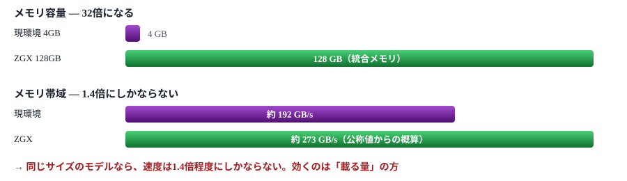

# ハードウェア選定の判断材料

VRAM 4GB という現在の制約を、どのハードウェアで、いくらで解決できるか

> 📅 作成: 2026-08-25 / 更新: 2026-09-30

[README](../../README.md)

## 目次

1. [製品概要とキャンペーン](#1-製品概要とキャンペーン)
2. [スペックの読み方 — 容量と帯域は別物](#2-スペックの読み方--容量と帯域は別物)
3. [何が動くようになるか](#3-何が動くようになるか)
4. [他の選択肢との比較](#4-他の選択肢との比較)
5. [移行時に効いてくる制約](#5-移行時に効いてくる制約)
6. [判断材料の整理](#6-判断材料の整理)

## この文書の位置づけ

[ローカルLLM 実行計画](../10_plan/p260824-01-ローカルLLM実行計画.md)の実測で、本PCの制約はすべて **VRAM 4GB** に集約されることが分かった。 9Bクラスで 8 tok/s、20B MoE で 5.9 tok/s、コンテキストは 8192 が上限——いずれもここから来ている。 この制約を金銭で解決する選択肢として、128GB 統合メモリの HP ZGX Nano G1n を軸に、 GPU（RTX 30 / 50 系・RTX PRO）、Mac Studio、NVIDIA DGX Spark を価格とあわせて比べる。 **購入を勧めるものではなく、判断材料を並べる目的の文書である。**

> [!IMPORTANT]
> **本書の「現環境」は、RAM 16GB のときの実測に基づく。** その後 RAM を 32GB に増設し、画面表示を内蔵GPU に任せたところ、9B は 14.6 tok/s、20B MoE は 19.0 tok/s、 コンテキストは KV を q8_0 にすれば 16384 まで使えるようになった。Qwen3-30B-A3B も RAM には載る。 ZGX との差は本書の比較より縮まっている。

## 1. 製品概要とキャンペーン

### HP ZGX Nano G1n AI Station

| 項目 | 内容 |
|---|---|
| プロセッサ | NVIDIA GB10 Grace Blackwell Superchip（Arm Cortex-X925 ×10 ＋ Cortex-A725 ×10） |
| **メモリ** | **128GB LPDDR5x**（オンボード・CPUとGPUで共有する統合メモリ） |
| ストレージ | 4TB PCIe 4.0 x4 NVMe SSD |
| OS | NVIDIA DGX OS 7（Ubuntu ベース） |
| AI 演算性能 | 最大 1,000 TOPS（低精度演算での値） |
| サイズ | 150 × 150 × 51 mm（手のひらサイズ） |
| 保証 | 1年（センドバック） |

### キャンペーン

| 項目 | 金額・条件 |
|---|---|
| HP希望販売価格 | ¥2,125,200（税込）〜 |
| **キャンペーン価格** | **¥1,098,900（税込）** |
| 割引 | ▲¥1,026,300（約 48% オフ） |
| 期間 | 2026-09-11 〜 2026-09-30 |
| 価格.com 限定モデル | ¥1,097,800 ＋ 送料 ¥1,650（HP 直販） |

### 想定用途

メーカーが挙げているのはエッジAI、コンピュータービジョン、AIモデルの開発・プロトタイピング、機械学習推論。 **個人が大きなモデルをローカルで動かす用途は、想定の中心ではない**が、 128GB という容量はまさにそこで効いてくる。

> [!IMPORTANT]
> **「最大2,000億〜4,050億パラメータ対応」という表記の読み方に注意。** この系統のマシンでは、単体で 200B 級、2台連結で 405B 級という説明がなされる。 ただしこれは<strong>「メモリに載る」という意味であって、「実用的な速度で動く」という意味ではない</strong>。 なぜそうなるかは次章で扱う。

## 2. スペックの読み方 — 容量と帯域は別物

### 生成速度を決めるのは帯域

計画書 第10章で確認したとおり、LLM の生成速度は**1トークンごとにモデル全体の重みをメモリから読み出す**時間で決まる。 つまり効くのは容量ではなく**メモリ帯域**である。4Bクラスが系列を問わず 56 tok/s で頭打ちになったのも、これが理由だった。

### 現環境との対比

| 項目 | 現環境 RTX 3050 Ti Laptop | ZGX Nano G1n | 倍率 |
|---|---:|---:|---:|
| 使えるメモリ | 3.21 GB（実測） | 約 120 GB | **約 37倍** |
| メモリ帯域 | 約 192 GB/s | 約 273 GB/s | 約 1.4倍 |
| 4Bクラスの速度 | 56.5 tok/s（実測） | 推定 70〜80 tok/s | 約 1.3倍 |

> [!IMPORTANT]
> **今使っている 4B モデルは、ほとんど速くならない。** 110万円を投じて 56 → 70 tok/s では割に合わない。 **この製品の価値は「速くなること」ではなく「今まったく動かないものが動くこと」にある**。 判断はその一点を軸にすべきで、既存モデルの高速化を期待すると外す。

#### 帯域値の出どころについて

上記の帯域は公称スペックからの概算である。現環境の 192 GB/s も理論値で、 計画書の実測（56.5 tok/s）から逆算すると実効効率は7割程度。ZGX 側も同様の効率と仮定して推定している。 ⚠ **実機で測っていない値**

## 3. 何が動くようになるか

### モデルサイズ別の見通し

帯域 273 GB/s、実効効率7割と仮定した粗い試算。**密モデルは「サイズ÷帯域」でおおよそ決まる**。

| モデル | Q4 のサイズ | 現環境 RAM 16GB | 現環境 RAM 32GB | ZGX（推定） |
|---|---:|---:|---:|---:|
| Qwen3-4B（密） | 2.3 GB | 56.5 tok/s | 58.9 tok/s | 70〜80 tok/s |
| gemma-4-E4B | 5.0 GB | 45.2 tok/s | 未測定 | 55〜65 tok/s |
| Qwen3.5-9B（密） | 5.2 GB | 8.1 tok/s | 14.6 tok/s | **30〜35 tok/s** |
| gemma-4-12B（密） | 6.9 GB | 未測定（低速） | 未測定 | 25〜28 tok/s |
| Qwen2.5-Coder-14B（密） | 8.4 GB | 未測定（低速） | 未測定 | 20〜23 tok/s |
| **gpt-oss-20b（MoE）** | 11.3 GB | 5.9 tok/s | **19.0 tok/s** | **50〜70 tok/s** |
| **Qwen3-30B-A3B（MoE）** | 18 GB | **動かない** | 動く（UD-Q4_K_XL・16.5 GB）・生成速度は未測定 | **50〜70 tok/s** |
| 70B クラス（密） | 約 40 GB | **動かない** | **動かない** | 4〜5 tok/s |
| 200B クラス（密） | 約 110 GB | **動かない** | **動かない** | 1.5〜2 tok/s |

### 最大の恩恵は MoE にある

表で突出しているのは MoE の行である。計画書 第7章で整理したとおり、 MoE は**総パラメータをメモリに置く必要がある一方、毎トークン読むのは active な一部だけ**。

| モデル | 総 / active | 現環境で起きていること | ZGX なら |
|---|---|---|---|
| gpt-oss-20b | 21B / 3.6B | RAM 16GB 時は、11.3 GB が RAM 15.8 GB を圧迫し、エキスパートをCPUに逃がして 5.9 tok/s。32GB に増設後は 19.0 tok/s | 全部がメモリに収まり、読むのは 3.6B 相当だけ |
| Qwen3-30B-A3B | 30B / 3B | **Q4 の 18 GB が RAM に載らず起動できない** | 余裕をもって収まる |

計画書 第7章では「Qwen3-30B-A3B を IQ2_M（約11GB）まで落とせば RAM 16GB に収まるかもしれない」という 苦しい検討をしていたが、**128GB あれば Q4 のまま置ける**。品質を落とす必要がなくなる。

> [!IMPORTANT]
> **「200B が動く」を額面どおり受け取らない。** 密の 200B クラスは**1.5〜2 tok/s** の見込みで、これは計画書で「対話には遅すぎる」と切り捨てた 12Bクラス（2〜3 tok/s）より遅い。**載ることと使えることは別**である。 実用になるのは MoE か、30B 程度までの密モデルまでと見るのが妥当。

## 4. 他の選択肢との比較

### 選択肢と価格（2026-09-27 時点）

| 選択肢 | 使えるメモリ | 帯域（公称） | 価格 | 性格 |
|---|---:|---:|---:|---|
| **HP ZGX Nano G1n** | 約 120 GB（統合） | 約 273 GB/s | ¥1,098,900 （9/30 まで） | **容量で殴る**。大きいモデルが載る。速度は控えめ |
| NVIDIA DGX Spark | 約 120 GB（統合） | 約 273 GB/s | ¥1,045,000 | ZGX と同じ GB10 を積む NVIDIA 純正機。ZGX より約5万円安い |
| Mac Studio （M5 Max・18/40コア・128GB・1TB） | 約 120 GB（統合） | 約 614 GB/s | ¥941,800 | 容量と帯域のバランスが良い。**帯域は ZGX の約2.2倍で、約16万円安い** |
| RTX PRO 6000 Blackwell Max-Q | 96 GB | 約 1,790 GB/s | ¥2,593,800〜 | 1枚で 96GB。価格は桁が違う |
| RTX 5090 | 32 GB | 約 1,790 GB/s | ¥864,445〜 | **速度で殴る**。32GB に収まる範囲なら圧倒的に速い |
| RTX 5080 | 16 GB | 約 960 GB/s | ¥267,700〜 | 16GB の上位 |
| RTX 5070 Ti | 16 GB | 約 896 GB/s | ¥206,806〜 | 帯域は 5080 と大差ない |
| RTX 5060 Ti 16GB | 16 GB | 約 448 GB/s | ¥104,800〜 | 16GB を最も安く手に入れる |
| RTX 3090（中古） | 24 GB | 約 936 GB/s | 約 17.5〜21.2 万円 | 24GB を最も安く手に入れる。2枚で 48GB。消費電力と設置の手間が大きい |
| **現状維持** | 3.87 GB | 約 192 GB/s | 0 円 | RAM 32GB 後は、4B が 59 tok/s、gpt-oss-20b が 19 tok/s |

グラフィックボードの価格はカード単体で、価格.com の最安値（新品）。RTX 3090 の中古はヤフオクの落札（動作品）で、店頭（じゃんぱら）は ¥219,980〜の1点のみだった。 帯域は各社の公称値で、本書では測っていない。

> [!IMPORTANT]
> **本PCはノートなので、グラフィックボードは差し替えられない。** 表の GPU を選ぶと、カード代とは別に、それを載せるデスクトップ本体（CPU・マザーボード・電源・ケース）が要る。 本体一式で届く ZGX・DGX Spark・Mac Studio と比べるときは、その分を足して見る。

### この表から読めること

#### Mac Studio が正面の競合になる

同じ 128GB クラスで、**帯域は Mac の方が約2.2倍**。同じモデルを動かすなら Mac の方が速い。 **価格も Mac の方が約16万円安い**。ZGX が優位に立つのは以下の点になる。

- **CUDA エコシステムがそのまま使える** — 学習・ファインチューニング、NVIDIA のソフトウェアスタック
- DGX OS による NVIDIA 純正の開発環境
- 2台連結でメモリを倍にできる拡張性
- 手のひらサイズと低消費電力

逆に**推論だけが目的なら、Mac Studio の方が素直に速い**可能性が高い。

#### ZGX を選ぶなら DGX Spark と比べる

DGX Spark は ZGX と同じ GB10・128GB を積む NVIDIA 純正機で、約5万円安い。 中身が同じなので、差は価格・保証・販売経路になる。

#### RTX 5090 とは用途が分かれる

32GB に収まるモデル（30B 密の Q4、70B の低ビット量子化まで）なら、5090 は ZGX の6倍以上の帯域で圧倒する。 **32GB を超えるかどうかが分水嶺**で、超えないなら 5090、超えるなら ZGX という切り分けになる。 ただし 5090 はカード単体で約86万円あり、デスクトップ本体を足すと ZGX を上回る。

> [!IMPORTANT]
> **現状維持という選択肢を最初に潰しておく必要がある。** 計画書の結論では、Qwen3-4B が 56.5 tok/s、gemma-4-E4B が 45.2 tok/s で、 **日常的な対話とコード生成には足りている**。 110万円の判断は「今のモデルで何が不足しているか」を具体化してからで遅くない。

## 5. 移行時に効いてくる制約

### Arm アーキテクチャである

GB10 の CPU 部は Arm（Cortex-X925 / A725）。**x86 用のバイナリは動かない**。

| 今使っているもの | 移行時にどうなるか |
|---|---|
| `llama-b10612-bin-win-cuda-12.4-x64` | ❌ **使えない** Windows x64 版。Linux arm64 版を取り直す |
| `tools\50_run\*.cmd` | ❌ **使えない** シェルスクリプトに書き直す |
| GGUF モデル本体 | ✅ **そのまま使える** アーキテクチャ非依存の形式 |
| LM Studio | ⚠ **要確認** Linux arm64 版の提供状況次第 |
| 計画書の知見 （`-ngl` / `--n-cpu-moe` の考え方） | ⚠ **前提が変わる** 統合メモリなので「GPUに何層載せるか」という発想自体が薄れる |

### OS が変わる

DGX OS 7 は Ubuntu ベース。**Windows 環境ではなくなる**ため、 既存の作業フロー（PowerShell スクリプト、Windows 上の他ツールとの連携）はそのまま持ち込めない。 LAN 越しにサーバとして使い、手元の Windows から API で叩く構成が現実的と思われる。

### 統合メモリの意味が変わる

現環境では「VRAM 4GB に何を載せるか」が計画の中心だったが、 統合メモリでは CPU と GPU が同じ 128GB を共有する。 **計画書 第6章の VRAM 配分の議論は、そのままの形では引き継がれない**。 一方で「帯域が速度を決める」という原則は変わらないため、第10章の分析はそのまま通用する。

### 確認できていない点

- **未確認** キャンペーンの期間と、現時点で在庫が残っているか
- **未確認** 実機での llama.cpp の実測値。本書の推定はすべて公称スペックからの計算
- **未確認** 2台連結（405B対応）に必要な追加費用と構成
- **未確認** 1年保証以降のサポート体制。業務利用なら延長保証の要否
- **未確認** 消費電力と発熱。手のひらサイズだが常時稼働に耐えるか

## 6. 判断材料の整理

### 買う理由になるもの

| 動機 | 内容 |
|---|---|
| ✅ **強い** MoE を本気で使う | Qwen3-30B-A3B クラスが Q4 のまま 50〜70 tok/s で動く。現環境は RAM 16GB 時は起動すらできなかった（32GB 後は Q4 のまま動き、Claude Code の読み書きの試験にも合格した。生成速度は未測定） |
| ✅ **強い** 学習・ファインチューニング | 推論だけなら他の選択肢もあるが、CUDA での学習となると 128GB は大きな武器になる |
| ⚠ **中** 長いコンテキスト | 現在 8192 が上限。統合メモリなら KV キャッシュの制約がほぼ消える |
| ⚠ **中** 価格 | 48% オフは大きい。ただし 9月30日までの期間限定で、判断を急がされる構造でもある |

### 買わない理由になるもの

| 懸念 | 内容 |
|---|---|
| ❌ **強い** 今のモデルは速くならない | 常用している 4B は 56 → 70 tok/s 程度。110万円の対価としては薄い |
| ❌ **強い** 用途が未確定 | 計画書 第9章の時点で「常用する用途」は未定のまま。**何に使うかが決まる前の投資になる** |
| ⚠ **中** 帯域では Mac に劣る | 推論用途に絞れば Mac Studio の方が約2倍速い。同価格帯 |
| ⚠ **中** 環境の作り直し | Arm ＋ Linux。今回組んだ Windows の環境とスクリプトは引き継げない |

### 判断を進めるなら

本書で結論は出さない。判断するとしたら、順序は次のようになる。

1. **今の環境で足りない場面を具体的に挙げる** — 「4B では答えが不正確」「20B を待てない」など。 計画書 第10章の品質評価では、Qwen3-4B の誤答と gemma-4-E4B の正答という差が既に出ている。 **E4B の 45 tok/s で足りるなら、そもそも投資の必要がない**
2. **用途が推論だけか、学習も含むかを決める** — 推論だけなら Mac Studio が対抗になる
3. **32GB で足りるかを見極める** — 足りるなら RTX 5090 の方が速く、安い
4. そのうえで 128GB が要るなら、キャンペーン価格は妥当な水準

> [!IMPORTANT]
> **期限付きの割引は、判断の順序を狂わせやすい。** 期間限定という条件は「今決めないと損」という圧力を作るが、 上の1番——**今の環境の何が不足しているか**——が空欄のままでは、 どの選択肢が正解かを決めようがない。まずそこを埋めるのが先で、 埋まらないなら「今は買わない」が答えになる。

## 参考資料

### 価格の出典（2026-09-27 に確認）

- [HP ZGX Nano G1n AI Station 製品詳細・スペック](https://jp.ext.hp.com/workstations/zgx_nano_ai_station/) （日本HP）— ZGX の仕様・希望販売価格・キャンペーン価格と期間
- [HP ZGX Nano G1n AI Station キャンペーン](https://jp.ext.hp.com/campaign/business/workstations/zgx_campaigns/) （日本HP）— キャンペーンの案内
- [HP ZGX Nano G1n AI Station 価格.com 限定モデル](https://kakaku.com/item/K0001803112/)（価格.com）
- [NVIDIA DGX Spark](https://shop.elsa-jp.jp/view/item/000000001031)（ELSA ONLINE）
- [Mac Studio を購入](https://www.apple.com/jp/shop/buy-mac/mac-studio)（Apple）— M5 Max 128GB 構成の価格は構成画面で確認
- [GeForce RTX 5090 のグラフィックボード（安い順）](https://kakaku.com/pc/videocard/itemlist.aspx?pdf_Spec103=500&pdf_so=p1)（価格.com）。 RTX 5080・5070 Ti・5060 Ti・3090 も同じ一覧でチップ種類を切り替えて確認
- [RTX PRO 6000 Blackwell の検索結果](https://search.kakaku.com/RTX%20PRO%206000%20Blackwell/)（価格.com）
- [RTX3090 24GB の落札相場](https://auctions.yahoo.co.jp/closedsearch/closedsearch?p=RTX3090+24GB)（Yahoo!オークション）
- [RTX 3090 の中古販売](https://www.janpara.co.jp/sale/search/result/?KEYWORDS=rtx3090&CHKOUTCOM=1&ORDER=3)（じゃんぱら）

### 関連する自プロジェクトの文書

- [ローカルLLM 実行計画](../10_plan/p260824-01-ローカルLLM実行計画.md) — 第10章の実測値（RAM 16GB 時の 56.5 / 45.2 / 8.1 / 5.9 tok/s、空き VRAM 3287 MiB）を本書の比較基準に用い、32GB での再測定の値を追記している

> [!IMPORTANT]
> **価格は 2026-09-27 時点の記載に基づく。** ZGX のキャンペーンは 9月30日までで、終了後の価格は記載がない。 グラフィックボードは値動きが大きい。判断の際は必ず上記のページで現在の価格を確認すること。

> [!IMPORTANT]
> **性能の数値はすべて推定である。** 第2章のメモリ帯域（約 273 GB/s）、第3章のモデル別 tok/s、第4章の他機種の帯域は、 いずれも公称スペックからの計算であり**実機で測っていない**。 現環境の実測値（192 GB/s に対し 56.5 tok/s）から逆算した実効効率7割を、他機種にも当てはめている。

[README](../../README.md)
