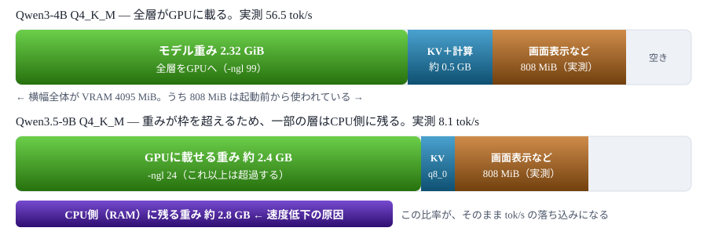
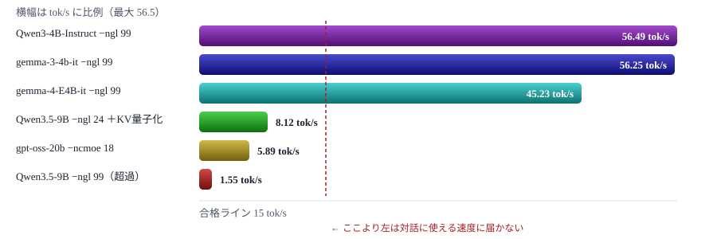

# ローカルLLM 実行計画

RTX 3050 Ti Laptop（VRAM 4GB）／RAM 16GB のノートPCで動かすための、ソフトウェア選定・入手方法・モデル選定・導入手順<br> 📅 作成: 2026-08-24 / 更新: 2026-09-27

[README](../../README.md)

## 目次

1. [前提 — このPCで何がどこまで動くか](#1-前提--このpcで何がどこまで動くか)
2. [実行ソフトウェアの候補と比較](#2-実行ソフトウェアの候補と比較)
3. [選択 — llama.cpp を主軸にする](#3-選択--llamacpp-を主軸にする)
4. [入手方法 — 配布バイナリか自前コンパイルか](#4-入手方法--配布バイナリか自前コンパイルか)
5. [モデルの選択 — 手持ち資産の棚卸し](#5-モデルの選択--手持ち資産の棚卸し)
6. [量子化・VRAM配分・コンテキスト長](#6-量子化vram配分コンテキスト長)
7. [新規ダウンロードの検討 — 最新量子化とMoE](#7-新規ダウンロードの検討--最新量子化とmoe)
8. [導入手順（ステップ計画）](#8-導入手順ステップ計画)
9. [検証計画と評価基準](#9-検証計画と評価基準)
10. [実測結果 — 2026-08-25](#10-実測結果--2026-08-25)

## この文書の位置づけ

ローカルLLMを常用できる状態にするまでの計画をまとめる。実行環境は本PCの実測値をそのまま前提とし、 「どのソフトウェアを使うか」「実行ファイルをどう入手するか」「どのモデルを使うか」「何を追加取得するか」の4つの選択について、 候補を並べたうえで採用案とその理由を示す。実際のインストール作業は本文書で合意が取れてから着手する。

## 1. 前提 — このPCで何がどこまで動くか

### 実測したハードウェア構成

| 項目 | 実測値 | LLM実行上の意味 |
|---|---|---|
| CPU | Intel Core i7-11370H（4コア8スレッド） | CPU推論のフォールバックとしては非力。4コアなのでCPUオフロードは速度が伸びない |
| RAM | 15.8 GB | OS・ブラウザを差し引くと実質10GB前後。CPU側に置ける重みは上限がある |
| GPU | NVIDIA GeForce RTX 3050 Ti Laptop | CUDA が使える。世代は Ampere で、GGUF の主要量子化はすべて対応 |
| VRAM | 4096 MiB（4 GB） | ⚠ **最大の制約** ここが計画全体を決める |
| ドライバ | 592.82 | 十分に新しい。CUDA 12.x 系のバイナリがそのまま動く |
| 内蔵GPU | Intel Iris Xe | 画面表示をこちらに寄せられれば、NVIDIA側のVRAMを推論にほぼ全部使える |
| 空き容量 | C: 約 385 GB | モデルを何本置いても問題にならない |
| 既存環境 | LM Studio 導入済み | `lms` コマンドが存在する |
| Ollama | 導入後アンインストール済み | 一度使ったうえで LM Studio に置き換えた経緯がある。**再導入しない前提** |
| 利用実績 | Claude Code → LM Studio | ローカルの OpenAI 互換API に Claude Code から問い合わせる形で使用した経験がある。✅ **接続方式が既に確立している** |
| ビルド環境 | Visual Studio・CUDA Toolkit・CMake いずれも未導入 | 自前コンパイルには追加インストールが要る（第4章）。Git は導入済み |

### 結論としての実行可能ライン

VRAM 4GB は「小型モデルなら完全にGPUに載る／中型モデルは載らない」の境目にあたる。 4bit量子化での目安は次のとおり。

| パラメータ数 | Q4_K_M の重み | 4GB VRAM での扱い | 計画時の予測 | 実測 |
|---|---:|---|---|---|
| 3〜4B | 2.0〜2.6 GB | ✅ **全層GPU** コンテキストも余裕をもって取れる | 25〜40 tok/s | **56 tok/s** |
| 7〜8B | 4.5〜5.0 GB | ⚠ **部分オフロード** 6〜7割をGPU、残りをCPU | 6〜10 tok/s | **8 tok/s** |
| 12〜14B | 7.3〜9.0 GB | ❌ **ほぼCPU実行** GPUは3割程度しか担えない | 2〜3 tok/s | 未測定 |
| 30B級（密） | 18 GB 前後 | ❌ **不可** RAM 16GB にも収まらない | — | — |
| 20B級（MoE） | 11 GB 前後 | ⚠ **エキスパートをCPUへ** RAMが律速になる | — | **5.9 tok/s** |

> [!IMPORTANT]
> **この表の「パラメータ数」による仕分けには例外がある。** Per-Layer Embeddings を持つ Gemma の E系（E2B / E4B）は、 パラメータ数の割に GPU に載る量が少なく、上の分類より1段速い側に着地する。 実測では 7.52B の E4B が **45 tok/s** と、4Bクラスに近い速度で動いた（第10章）。

## 2. 実行ソフトウェアの候補と比較

ローカルでLLMを走らせる手段は大きく4系統ある。本PCの制約（VRAM 4GB・Windows・単一ユーザー）で現実的なものを並べる。

### 候補A — llama.cpp（`llama-server` / `llama-cli`）

GGUF形式の量子化モデルを実行するC++実装。GPUに載りきらない分をCPUに逃がす「部分オフロード」を層単位で制御できる。 公式リリースに Windows 向け CUDA ビルド済みバイナリがあり、コンパイルは不要。

- ✅ **利点** 層数（`-ngl`）・KVキャッシュ量子化・コンテキスト長を細かく指定でき、4GBという厳しい枠に対して調整の余地が最も大きい
- ✅ **利点** OpenAI互換のHTTP APIサーバと簡易WebUIが同梱される。他ツールからの接続先として使い回せる
- ✅ **利点** zipを展開するだけで、レジストリもサービスも汚さない。プロジェクトフォルダ内で完結する
- ⚠ **欠点** モデルのダウンロードは自前。GGUFファイルを手で取得して配置する
- ⚠ **欠点** オプションが多く、初回は起動コマンドを組み立てる手間がある

### 候補B — Ollama **評価済み・不採用**

内部で llama.cpp を使いつつ、モデル取得・常駐サーバ・APIを一体化したツール。`ollama run qwen3:4b` の一行で動き出す。 **本PCでは一度導入したうえで、LM Studio に置き換える判断が既に下されている。**

- ✅ **利点** 導入と運用が最も簡単。モデル管理も `ollama pull` で完結する
- ✅ **利点** 対応クライアントが多く、外部ツールから繋ぐ相手として最も普及している
- ⚠ **欠点** オフロード層数やKVキャッシュの調整が抽象化されており、4GBの枠を詰めきる用途では手が届きにくい
- ⚠ **欠点** 常駐サービスとして入り、モデルの保存先も既定ではユーザープロファイル配下になる
- ❌ **実績** 過去に導入したがアンインストール済み。同じ理由で再導入しても状況は変わらない

### 候補C — LM Studio ✅ **導入済み・使用実績あり**

GUIアプリ。モデル検索・ダウンロード・チャット・ローカルAPIサーバまで画面上で完結する。 本PCでは **Claude Code から LM Studio のローカルAPIに問い合わせる形で使った実績**があり、外部ツールとの接続まで確認できている。

- ✅ **利点** 既に入っているので追加コストがゼロ。GPUオフロード量をスライダーで動かして即座に効果を見られる
- ✅ **利点** モデル比較の「試着室」として優秀。どのモデルが日本語で使えるかを短時間で判定できる
- ✅ **利点** OpenAI互換APIサーバとしての実運用が確認済み。同じ接続方式が llama.cpp にもそのまま通じる
- ⚠ **欠点** GUI前提でありスクリプトからの再現性が低い。設定の差分を文書に残しにくい
- ⚠ **欠点** クローズドソースで、モデル保存先もアプリ管理下にある

### 候補D — vLLM / TGI / TensorRT-LLM

サーバ用途の高スループット推論エンジン。

- ❌ **不採用** いずれも非量子化または高精度量子化の重みをVRAMに全展開する設計で、最低でも 12〜24GB クラスのGPUを想定している
- ❌ **不採用** Windows ネイティブ対応が弱く、WSL2 経由になると VRAM がさらに目減りする

### 比較表

| 観点 | llama.cpp | Ollama | LM Studio | vLLM 系 |
|---|---|---|---|---|
| 導入の手軽さ | 中（zip展開） | 高 | 高（導入済み） | 低 |
| 4GB VRAM での詰め | **高** | 中 | 中 | 不可 |
| 設定の再現性 | **高**（コマンド行） | 中 | 低（GUI） | 高 |
| API提供 | OpenAI互換 | 独自＋OpenAI互換 | OpenAI互換 | OpenAI互換 |
| 環境の汚れにくさ | **高**（フォルダ完結） | 低（常駐サービス） | 中 | 低 |
| モデル入手 | 手動 | 自動 | GUI検索 | 手動 |

## 3. 選択 — llama.cpp を主軸にする

### 採用案

| 役割 | 採用するもの | 理由 |
|---|---|---|
| 本番の実行基盤 | **llama.cpp（CUDAビルド済みバイナリ）** | VRAM 4GB では「何層GPUに載せるか」の1〜2層の差が体感速度を左右する。そこを直接指定できるのが決め手 |
| モデルの下見 | LM Studio（導入済みを流用） | 候補モデルの日本語品質を短時間で比較するのに向く。GGUFの入手経路としても使える |
| バイナリの入手 | 公式配布のCUDAビルド<br>（コンパイルは条件付きで後日） | 第4章で比較する。まずは追加インストールなしで動かし、必要が生じた時点でビルド環境を整える |
| Ollama | **再導入しない** | llama.cpp と役割が重複する。過去に導入して LM Studio に置き換えた経緯があり、判断を覆す材料が今のところ無い |

### llama.cpp を主軸に置く理由

#### 1. 制約が厳しいほど、細かい制御が効く

4GBという枠では、7〜8Bモデルを「載る範囲だけGPUに置く」運用が現実的な選択肢になる。 llama.cpp は `-ngl`（GPUに載せる層数）を整数で指定でき、KVキャッシュ自体も量子化して容量を空けられる。 GUIのスライダーや自動判定に任せると、ここで数tok/sを取りこぼす。

#### 2. 設定が一行のコマンドとして残る

起動オプションをそのまま `.cmd` ファイルに書けるので、「どの設定で何 tok/s 出たか」を文書と対応づけて記録できる。 第7章の検証計画は、この再現性があって初めて成立する。

#### 3. プロジェクトフォルダで完結する

バイナリ・モデル・起動スクリプトをすべてこのプロジェクト配下に置ける。 不要になったらフォルダごと消せばよく、システムに残るものがない。

### 想定するフォルダ構成

```
20260824-local-llm-llama-cp/
├─ bin/
│   └─ llama.cpp/          … 公式配布のCUDAビルド一式を展開
├─ tools/50_run/
│   ├─ run-server.cmd       … llama-server の起動
│   └─ bench.cmd            … llama-bench による速度計測
├─ notes/10_plan/           … 本文書
├─ etc/                     … 補助スクリプト（git管理外）
└─ tmp/                     … 一時ファイル（git管理外）

C:\AI_Models\                … GGUF の実体（LM Studio と共用・移動しない）
```

モデルは既に `C:\AI_Models` にあり、LM Studio と共用する。 プロジェクト配下に複製せず、起動スクリプトから絶対パスで参照する（第7章 Step 2）。

> [!NOTE]
> **LM Studio を残す狙いはモデル選定の高速化にある。** 第4章の候補は最終的に1〜2本に絞るが、その判断は実際に日本語で数往復させてみないと下せない。 llama.cpp で毎回コマンドを組み立てるより、GUIで切り替えたほうが試行回数を稼げる。

## 4. 入手方法 — 配布バイナリか自前コンパイルか

llama.cpp を使うと決めたうえで、実行ファイルをどう手に入れるかにさらに選択がある。 公式が Windows 向けのビルド済みバイナリを配布しているので、コンパイルは必須ではない。

### 準備コストの比較


### 案A — 公式配布のビルド済みバイナリ

- ✅ **利点** 追加インストールが一切いらない。GPUドライバだけで動く
- ✅ **利点** zipを展開するだけなので、失敗しても消せば元に戻る
- ✅ **利点** 更新はzipを差し替えるだけ。llama.cpp は更新が速いので、この差し替えの軽さは効く
- ⚠ **欠点** リリースタグの時点のコードしか使えない。ごく新しいモデルへの対応は数日〜数週間待つことがある
- ⚠ **欠点** コードに手を入れられない

### 案B — 自分でコンパイルする（CUDAバックエンド）

#### 必要な準備（本PCの現状を実測）

| 必要なもの | 現状 | 役割 | 容量 |
|---|---|---|---:|
| **Visual Studio 2022 Build Tools**<br>（C++によるデスクトップ開発） | ❌ **未導入** | MSVCコンパイラ・Windows SDK。CUDAのホスト側コンパイラとして必須 | 約 8 GB |
| **CUDA Toolkit 12.x** | ❌ **未導入** <br>（`nvcc` なし） | GPUカーネルをコンパイルする `nvcc` と cuBLAS | 約 5 GB |
| **CMake** | ❌ **未導入** | ビルド構成の生成 | 約 100 MB |
| Git | ✅ **導入済み** | ソースの取得と更新 | — |
| Ninja（任意） | **未導入** | MSBuild より並列ビルドが速い。無くてもよい | 数 MB |

#### 導入コマンド（順序が重要）

```
REM 1) まず CMake
winget install Kitware.CMake

REM 2) 次に Visual Studio Build Tools（C++ワークロードを明示的に選ぶ）
winget install Microsoft.VisualStudio.2022.BuildTools

REM 3) 最後に CUDA Toolkit
winget install Nvidia.CUDA
```

> [!WARNING]
> **CUDA Toolkit は Visual Studio より後に入れる。** CUDAのインストーラは既存のVisual Studioを検出してビルド統合を書き込む。 順序を逆にすると統合が入らず、CMakeがCUDAコンパイラを見つけられない。入れ直しになるので最初から順序を守る。

Build Tools は winget で入れた後、Visual Studio Installer を開いて **「C++によるデスクトップ開発」ワークロード**にチェックが入っているか確認する。 既定では最小構成しか入らず、MSVCコンパイラ本体が欠けることがある。

#### ビルド手順

```
git clone https://github.com/ggml-org/llama.cpp
cd llama.cpp
cmake -B build -DGGML_CUDA=ON -DCMAKE_CUDA_ARCHITECTURES=86
cmake --build build --config Release -j 4
```

| オプション | 意味 |
|---|---|
| `-DGGML_CUDA=ON` | CUDAバックエンドを有効にする。これが無いとCPU専用バイナリになる |
| `-DCMAKE_CUDA_ARCHITECTURES=86` | RTX 3050 Ti（Ampere）の compute capability は 8.6。ここを絞らないと全世代向けにカーネルを吐き、ビルド時間が数倍になる |
| `-j 4` | 物理コア数に合わせる。8スレッドあるが、メモリを食うので4が無難 |

成果物は `build\bin\Release\` に出る。所要時間は本PCの4コアで **30〜90分**を見込む。 CUDAカーネルのコンパイルが支配的で、CPUが遅いほど伸びる。

#### 利点と欠点

- ✅ **利点** 最新コミットをその日のうちに使える。新しいモデル形式への対応が入った直後に試せる
- ✅ **利点** 自分のGPU向けだけをビルドするので、バイナリが小さく起動も軽い
- ✅ **利点** コードに手を入れられる。ログを足す、パラメータを変えるといった実験ができる
- ❌ **欠点** 準備に約 13 GB のインストールと、初回1〜2時間の作業が要る
- ❌ **欠点** llama.cpp を更新するたびに再ビルドが要る。zip差し替えの数十倍の手間になる
- ❌ **欠点** VS・CUDA・CMakeの版の組み合わせで失敗しうる。ビルドエラーの切り分けが本題から逸れる
- ❌ **欠点** <strong>速くならない。</strong>案Aと同じカーネルが動くだけで、推論速度に差は出ない

### 案C — 自分でコンパイルする（Vulkanバックエンド）

CUDAの代わりに Vulkan を使うビルド。`-DGGML_VULKAN=ON` を指定する。 CUDA Toolkit（5GB）が不要になり、代わりに Vulkan SDK（約 1GB）だけで済む。

- ✅ **利点** 準備が案Bより軽い。内蔵GPU（Iris Xe）でも動かせる
- ❌ **欠点** NVIDIA GPU では CUDA バックエンドのほうが概ね速い。本PCでは CUDA が使える以上、選ぶ理由が薄い

Vulkan は「NVIDIAが使えない環境に持っていく」場合の逃げ道として覚えておく位置づけにとどめる。

### 採用案

| 時期 | 採用 | 理由 |
|---|---|---|
| ✅ **実施済み** 初期構築 | **案A（配布バイナリ）**<br>b10612 / CUDA 12.4 | 本計画の目的は「動く環境を作ってモデルを評価する」ことにあり、ビルド環境の構築はその前提ではない。**実際の所要は約20秒**（ダウンロード12秒＋展開8秒）で、13GBと数時間を先払いせずに済んだ |
| ⚠ **条件付き** 後日 | 案B（CUDAコンパイル） | 下のトリガーのどれかを踏んだ時点で着手する |
| **保留** | 案C（Vulkan） | CUDAが使える本PCでは優先度が低い |

#### 案Bに切り替えるトリガー

1. 使いたいモデルの対応が最新コミットにしか入っておらず、リリースを待てない <br>✅ **未発動** b10612 で gemma-4 / Qwen3.5 / Ministral-3 / Nemotron-3 すべて読み込めた
2. 配布バイナリが本PCで起動しない、または特定の量子化で不正な出力が出る <br>✅ **未発動** CUDA 12.4 版がそのまま動作
3. llama.cpp のコード自体に手を入れて試したいことが出てきた
4. ビルド環境が他の用途（C++開発）でも必要になり、13GBが本計画だけの負担でなくなった

実測の結果、**1・2 はいずれも発動しなかった**。当初は手持ちに新しい系列が多いことから アーキテクチャ未対応を懸念していたが、リリースの更新が追いついていた。 案Bは当面必要ない。

> [!NOTE]
> **ディスクは足りている。制約は時間のほう。** C: の空きは約 385 GB あるので、13 GB の追加インストール自体は問題にならない。 案Bを後回しにする判断は容量ではなく、「ビルド環境の整備がモデル評価を始めるまでの時間を数時間押し下げる」ことによる。

## 5. モデルの選択 — 手持ち資産の棚卸し

モデルは新規に選ぶのではなく、**既に `C:\AI_Models` にあるものから選ぶ**。 まずサイズ帯ごとの性格を押さえ、そのうえで手持ちを仕分ける。

### サイズ帯ごとの性格


### 手持ちのモデル資産

`C:\AI_Models` に LM Studio 経由で取得済みのGGUFが **26ファイル・約 86.0 GB** ある （当初 30ファイル・98.5 GB あったが、後述のとおり重複分を整理した）。 新規ダウンロードを検討する前に、この中から選べるかを確認する。以下は本体モデル（mmproj を除く）の一覧。

| モデル | 量子化 | サイズ | 4GB VRAM での見込み |
|---|---|---:|---|
| Ministral-3-3B-Instruct-2512 | Q4_K_M | 2.00 GB | ✅ **全層GPU** 最軽量。速度の上限を測る基準に使える |
| gemma-3-4b-it | Q4_K_M | 2.32 GB | ✅ **全層GPU** 安定して動く世代。比較の対照として有用 |
| **Qwen3-4B-Instruct-2507** | Q4_K_M | 2.33 GB | ✅ **全層GPU** 第一候補。既に手元にある |
| Qwen3-4B-Thinking-2507 | Q4_K_M | 2.33 GB | ✅ **全層GPU** 思考過程を出す版。トークンを多く消費するため体感は遅くなる |
| NVIDIA-Nemotron-3-Nano-4B | Q4_K_M | 2.64 GB | ✅ **全層GPU** ここまでが余裕をもって載る範囲 |
| deepseek-coder-6.7b-instruct | Q3_K_S | 2.75 GB | ⚠ **全層GPU** 載るが Q3_K_S は劣化が大きく、モデル自体も世代が古い |
| gemma-4-E2B-it | Q4_K_M | 3.19 GB | ⚠ **ほぼ載る** コンテキストを短くすれば全層に届く |
| DeepSeek-R1-0528-Qwen3-8B | Q4_K_M | 4.68 GB | ⚠ **部分オフロード** 推論特化。出力が長く、遅さが二重に効く |
| **gemma-4-E4B-it** | Q4_K_M | 4.97 GB | ✅ **実測 45.2 tok/s** PLE の 2730 MiB が CPU に分離され、GPU には 2868 MiB しか載らない。**この表の予想を覆した**（第10章） |
| Qwen3.5-9B | Q4_K_M | 5.24 GB | ⚠ **実測 8.1 tok/s** `-ngl 24` ＋KV量子化が最適点 |
| GLM-4.6V-Flash | Q4_K_M | 5.74 GB | ⚠ **部分オフロード** 視覚モデル。テキスト用途なら選ぶ理由が薄い |
| gemma-4-12B-it-QAT | Q4_0 | 6.50 GB | ❌ **大半がCPU** QAT版は同サイズで品質が高いが、速度が足りない |
| gemma-4-12B-it | Q4_K_M | 6.87 GB | ❌ **大半がCPU** 対話には遅すぎる |
| Ministral-3-14B-Reasoning-2512 | Q4_K_M | 7.67 GB | ❌ **大半がCPU** 推論特化＋大型で、体感は最も遅い部類 |
| Qwen2.5-Coder-14B-Instruct | Q4_K_M | 8.37 GB | ❌ **大半がCPU** コード用途としては魅力だが本PCでは待たされる |
| gpt-oss-20b | MXFP4 | 11.28 GB | ⚠ **MoEとして再評価** 総サイズは重いが active は 3.6B。第7章で `--n-cpu-moe` による実測対象にする |

### 「動くもの／動かないもの」の切り分け

手持ちに動かないモデルがあるとのことなので、原因を3つに分けて判別する。対処が全く違う。

#### 原因1 — メモリ超過（サイズで判別できる）

上表で ❌ **大半がCPU** 以下に該当するもの。 LM Studio が GPU に全部載せようとして失敗するか、載っても極端に遅い。 **llama.cpp で `-ngl` を明示的に下げれば「動く」状態には持ち込める**（速度は別問題）。 サイズと VRAM の引き算で事前に予測でき、原因としては最も分かりやすい。

#### 原因2 — ランタイムがアーキテクチャに未対応

手持ちには `gemma-4`・`Qwen3.5`・`Ministral-3`・`GLM-4.6V`・`Nemotron-3` といった新しい系列が多い。 GGUF は同じ拡張子でも中のアーキテクチャ識別子が違い、ランタイムが未対応だと **読み込み時点で「unknown model architecture」等のエラーで即座に失敗する**。 サイズが小さくても落ちるのが特徴で、原因1と区別できる。

- 対処は**ランタイムの更新**のみ。設定をいじっても直らない
- LM Studio ならランタイム更新、llama.cpp なら新しいリリースへの差し替え
- リリースにまだ入っていない場合、**第4章の案B（自前コンパイル）に切り替える実際の理由になる**

#### 原因3 — mmproj（視覚アダプタ）の扱い

`mmproj-*.gguf` は画像入力用の投影器で、単体では動かない。本体モデルとペアで指定して初めて機能する。 手持ちでは gemma-3-4b / gemma-4 系 / GLM-4.6V / Ministral-3 / Qwen3.5 に付属している。

- テキスト用途なら**mmproj を無視して本体だけ読み込めばよい**。それで動くならモデル自体は健全
- llama.cpp で画像も使う場合は `--mmproj` で明示的に指定する
- mmproj も VRAM を消費する。gemma-3-4b の 0.79 GB は本体 2.32 GB に対して無視できない

> [!TIP]
> **判別は「落ちるまでの速さ」で見当がつく。** 読み込み開始直後にエラーで止まるなら原因2、進捗が進んでからメモリ関連で落ちるなら原因1。 起動はするが画像を渡すと失敗するなら原因3。

### 採用案

| 位置づけ | モデル | 採用理由 |
|---|---|---|
| ✅ **第一候補** | **Qwen3-4B-Instruct-2507**<br>（Q4_K_M・2.33 GB） | 全層をVRAMに載せてなお余裕があり、コンテキストを長く取れる。小型帯では日本語の破綻が少ない。**既に手元にありダウンロード不要**。実測 56.5 tok/s で確定 |
| ✅ **第二候補** <br>（実測後に昇格） | **gemma-4-E4B-it**<br>（Q4_K_M・4.97 GB） | 当初は「部分オフロード枠」と見ていたが、実測 45.2 tok/s。**7.52B の品質を 4B クラスの速度で使える**ため、品質重視の枠はこちらに置き換わった |
| ⚠ **用途限定** <br>（当初の第二候補） | Qwen3.5-9B<br>（Q4_K_M・5.24 GB） | 実測 8.1 tok/s。対話には遅く、E4B に役割を譲った。バッチ処理など待てる作業向け |
| ✅ **対照** | gemma-3-4b-it<br>（Q4_K_M・2.32 GB） | 同じサイズ帯で系列の異なるモデル。Qwen3-4B の評価が「このサイズの限界」なのか「このモデルの癖」なのかを切り分ける |
| **保留** | Qwen2.5-Coder-14B | コード用途は魅力だが 8.37 GB は本PCに重い。必要になれば同系列の 7B を新規取得する |
| ⚠ **別枠** | gpt-oss-20b<br>（MXFP4・11.28 GB） | MoEなので密モデルの尺度では測れない。第7章で `--n-cpu-moe` による実測にかける |
| ❌ **対象外** | 12B以上の密モデル | 対話に耐える速度が出ない。保管はしておくが今回の検証からは外す |

<strong>初期構築に新規ダウンロードは要らない。</strong>第8章の Step 2 は「取得」ではなく「手持ちからの選定」になる。 そのうえで、最新の量子化形式とMoEには手持ちに無い伸びしろがあるため、第7章で別途検討する。

### 重複の整理 ✅ **2026-08-25 実施済み**

棚卸しの過程で、同じモデルが `gemma\` と `lmstudio-community\` の2箇所に置かれているものが見つかった。

#### 同一性の検証

削除の前に、本当に同じものかを確かめた。**結論から言うと、バイト単位では同一ではなかった。**

| ファイル | `gemma\` 側 | `lmstudio-community\` 側 | 差 |
|---|---:|---:|---:|
| gemma-4-12B-it-QAT-Q4_0.gguf | 6,975,878,560 B | 6,975,879,008 B | 448 B |
| mmproj-gemma-4-12B-it-QAT-BF16.gguf | 175,115,328 B | 175,115,328 B | 0 B |
| gemma-4-E4B-it-Q4_K_M.gguf | 5,335,289,664 B | 5,335,291,936 B | 2,272 B |
| mmproj-gemma-4-E4B-it-BF16.gguf | 991,551,840 B | 991,551,840 B | 0 B |

最初に異なるバイトは**先頭から 244 バイト目**、つまり GGUF のメタデータ領域にあった。中身を読むと差は変換元リポジトリ名だけだった。

```
gemma\ 側            : general.name     = "Gg Hf Qat_Gemma 4 12B It Qat Q4_0 Unquantized"
                       general.basename = "gg-hf-qat_gemma-4"
lmstudio-community\ 側: general.name     = "Google_Gemma 4 12B It Qat Q4_0 Unquantized"
                       general.basename = "google_gemma-4"
```

テンソルデータ側は、末尾から 5GB / 2GB / 0.5GB の3地点で 8MB ずつハッシュを取って照合し、**すべて一致**した。 同じ量子化結果を、変換元リポジトリ名だけ違う形で2回取得していたことになる。

#### LM Studio 側の見え方

`lms ls` で確認すると、LM Studio は両方を**別モデルとして認識していた**。

```
gemma/gemma-4-12b-it-qat            12B    gemma4    7.15 GB
google/gemma-4-12b-qat (1 variant)  12B    gemma4    7.15 GB   ← lmstudio-community\ 側
gemma/gemma-4-e4b-it                7.5B   gemma4    6.33 GB
google/gemma-4-e4b (1 variant)      7.5B   gemma4    6.33 GB   ← lmstudio-community\ 側
```

同じモデルが一覧に2回並ぶ状態で、片方を消しても残った方は認識され続ける関係にあった。

#### 実施した内容と結果

`lmstudio-community\` 側の4ファイルを削除し、空になったフォルダも併せて片付けた。

| 項目 | 実施前 | 実施後 |
|---|---:|---:|
| GGUF 総量 | 98.51 GB | 85.96 GB |
| ファイル数 | 30 | 26 |
| C: 空き容量 | 384.82 GB | 397.37 GB |
| LM Studio 認識モデル数 | 19 | 17 |

削除後、LM Studio の一覧では残った側の修飾が外れて `gemma-4-12b-it-qat` / `gemma-4-e4b-it` と表示されるようになった。 同名の競合が解消されたためで、**モデル自体は引き続き両方とも使える**。

> [!CAUTION]
> **「サイズが同じだから重複」で消すと危ない。** 今回は GB 単位に丸めた表示が一致していただけで、実際には数百〜数千バイトの差があった。 差がメタデータだけと確認できたから削除できたのであって、 テンソル側に差があれば別リビジョンとして両方残す判断になっていた。

## 6. 量子化・VRAM配分・コンテキスト長

### 量子化レベルの選び方

| 量子化 | 1パラメータ<br>あたり | 品質 | 判断 |
|---|---:|---|---|
| Q8_0 | 約 8.5 bit | ほぼ無損失 | ❌ **重すぎ** 4Bでも 4.3GB で枠に入らない |
| Q6_K | 約 6.6 bit | 劣化がほぼ分からない | ⚠ **3Bまで** 4Bだと 3.3GB でコンテキストを圧迫 |
| **Q5_K_M** | 約 5.7 bit | わずかに劣化 | ✅ **4Bの上振れ案** 約 2.9GB。速度に余裕があれば試す |
| **Q4_K_M** | 約 4.8 bit | 実用上の標準 | ✅ **既定** 容量と品質の釣り合いが最も良い |
| **Q3_K_M** | 約 3.9 bit | 劣化するが踏みとどまる | ⚠ **条件付き** 大きいモデルを載せる時の選択肢。`Q3_K_S` とは別物として扱う |
| Q3_K_S | 約 3.5 bit | 明確に崩れる | ❌ **避ける** 同じ3bitでも Q3_K_M より大きく落ちる |
| Q2_K | 約 3.0 bit | 破綻が目立つ | ❌ **密モデルでは使わない** MoEでは例外（第7章） |

### 実測データ — どこで品質が落ちるか

Llama-3.1-8B-Instruct に対して13種類の量子化を横並びで評価した結果がある。 下表の「ベンチ平均」は GSM8K・HellaSwag・IFEval・MMLU・TruthfulQA の非加重平均。

| 形式 | サイズ | Perplexity<br>(WikiText-2) | ベンチ平均 | F16比 |
|---|---:|---:|---:|---:|
| F16（基準） | 15.3 GiB | 7.32 | 69.47 | — |
| Q8_0 | 8.14 GiB | 7.33 | 69.41 | −0.09% |
| Q6_K | 6.28 GiB | 7.35 | 69.23 | −0.35% |
| Q4_K_S | 4.47 GiB | 7.62 | 69.17 | −0.43% |
| **Q3_K_M** | — | — | 68.07 | **−2.02%** |
| **Q3_K_S** | 3.49 GiB | 8.96 | 65.49 | **−5.73%** |

#### 読み取れること

- <strong>Q4 までは誤差の範囲。</strong>Q8 から Q4_K_S まで、ベンチ平均の落ちは1%未満に収まる。ここを削らない理由がない
- <strong>3bit帯は「S か M か」で別物。</strong>Q3_K_M は −2.02% で踏みとどまるのに、Q3_K_S は −5.73% で崖から落ちる。論文も「実装の詳細が『3bit』という見出しと同等以上に効く」と述べている
- <strong>壊れ方が均一ではない。</strong>GSM8K（数学推論）は Q3_K_S で 77.63 → 68.31 と 9.3ポイント落ちる一方、HellaSwag（常識）は基準から1ポイント程度しか動かない

Q2_K は上の評価には含まれていないが、別途 7B モデルで測った結果では **perplexity の悪化が Q4_K_M の約16倍**（+0.8698 対 +0.0535）。 3B クラスでは特定タスクが 0.0% になる報告もある。

> [!IMPORTANT]
> **同じファイルサイズなら、小さいモデルの Q4 が大きいモデルの Q2 に勝つ。** Q2 の劣化がモデルサイズの利得を食い潰すため。ただしこれは Q2 まで落とした場合の話で、 Q4 同士なら大きいモデルが有利になる（「Q4 と F16 の差は、同系列の 7B と 14B の差より小さい」）。 密モデルで 4GB に押し込むために Q2 まで下げるのは、ほぼ確実に損な取引になる。

### I-quant（imatrix）という選択肢

`IQ` で始まる形式は、代表的なテキストで各重みの重要度を測った行列（imatrix）を使い、 効きの大きい重みにビットを厚く配る。同じビット数でも K-quant より品質が高くなる。

| 形式 | K-quant との関係 | 本PCでの用途 |
|---|---|---|
| **`IQ4_XS`** | Q4_K_M と同等品質で約1割小さい | ✅ **有力** 9Bクラスを全層GPUに近づける |
| `IQ3_M` / `IQ3_XS` | IQ3_XS ≒ Q3_K_M の品質でやや小さい | ⚠ **条件付き** 全層GPU化と引き換えに品質を払う |
| `IQ2_M` | 2bit帯では最良の部類 | ⚠ **MoE限定** 密モデルには使わない |

効き目が最も大きいのは **Q2・Q3 の低ビット帯**。均一な量子化が破綻し始める領域ほど、重要度による配分が生きる。 逆に言えば Q4 以上ではあまり差がつかない。

> [!TIP]
> **imatrix の質に依存する。** キャリブレーションが不適切な I-quant は、同ビットの K-quant より**劣る**ことがある。 配布元が imatrix を明示しているものを選ぶ。また I-quant は復号の計算が K-quant より重く、 CPUオフロード比率が高い構成では「小さいのに遅い」ことがある。

### 1bit帯は選択肢に入らない

`Q1_K` のような K-quant は存在しない。1bit帯にあるのは I-quant と三値量子化で、いずれも本PCでは使い道がない。

| 形式 | bpw | 位置づけ |
|---|---:|---|
| `IQ1_S` | 1.56 | 70B以上の巨大モデルを無理やり載せる時のみ |
| `IQ1_M` | 1.75 | 同上。IQ1_S よりやや余裕がある |
| `TQ1_0` | 1.69 | 三値（−1/0/+1）。**BitNet系のように最初から三値で学習されたモデル専用** |
| `TQ2_0` | 2.06 | 同上 |

TQ系は通常のモデルを変換しても意味がなく、IQ1系を 4B や 9B に適用すれば完全に崩壊する。 ❌ **本計画では対象外**

### 4GB をどう配分するか



### コンテキスト長の設定

KVキャッシュはコンテキスト長に比例してVRAMを食う。長さを倍にすればキャッシュも倍になる。 本PCでは以下を出発点とする。

| モデル | コンテキスト | 備考 |
|---|---:|---|
| Qwen3-4B | 8192 | ✅ **実測で確定** 16384 にすると KV が VRAM を超えて 1.30 tok/s に崩壊する（第10章）。**8192 が上限** |
| Qwen3.5-9B | 4096 | KVを削って重みを1層でも多くGPUに載せるほうが速い |
| gemma-4-E4B | 8192 | KVが 14 MiB しか要らない（SWA ＋ `shared_kv_layers=18`）ため、この系列だけは余裕がある |

#### KVキャッシュ量子化という手

llama.cpp は KVキャッシュ自体を8bit量子化できる（`--cache-type-k q8_0 --cache-type-v q8_0`）。 キャッシュ容量がおよそ半分になるので、その分を重みのオフロードに回せる。 8Bモデルを載せる場合はこれを併用する前提で層数を決める。

> [!TIP]
> **画面表示を内蔵GPUに逃がすと 0.3〜0.5GB 取り戻せる。** Windowsの「グラフィックスの設定」でブラウザやエディタを省電力（Iris Xe）側に割り当てると、 NVIDIA側のVRAMが空く。8Bモデルでは、この差がオフロード1〜2層分に相当する。

## 7. 新規ダウンロードの検討 — 最新量子化とMoE

第5章のとおり手持ちだけでも始められるが、手持ちの大半は `Q4_K_M` の密モデルに偏っている。 **量子化形式**と**MoEアーキテクチャ**の2つの軸には、4GB VRAM という制約に対して効く選択肢が残っている。 容量は 385 GB 空いているので、取得コスト自体は低い。

### 軸1 — 量子化形式

形式ごとの品質・サイズの関係は第6章にまとめた。新規取得の観点で効くのは `IQ4_XS` で、 Q4_K_M と同等品質のまま約1割小さく、9Bクラスを全層GPUに近づけられる。 ここでは手持ちにある特殊な形式2つと、誤解しやすい QAT の位置づけを整理する。

#### QAT はサイズを減らす技術ではない

手持ちの `gemma-4-12B-it-QAT-Q4_0`（6.50 GB）を見て 「QAT なら大きくても VRAM に載るのでは」と考えたくなるが、**これは成り立たない**。

- QAT（Quantization Aware Training）は**学習側の手法**で、量子化されることを織り込んで再学習する
- 適用先は既存の `Q4_0` 形式そのもの。**ファイルサイズは通常の Q4_0 と変わらない**
- 得られるのは「同じサイズでより高い品質」であって、サイズ削減ではない
- むしろ QAT の Q4_K_M 版は非QAT版より大きいという報告もある（9.5 GB 対 7.6 GB）

そして `gemma-4-12B-it-QAT` は**密モデル**なので、次節の MoE のようなエキスパート退避も効かない。 毎トークン全パラメータが必要で、6.50 GB を 4 GB に収める方法がない。 ❌ **4GB VRAM では動かない**

#### 手持ちにある特殊な形式

| 形式 | 仕組み | 該当する手持ち |
|---|---|---|
| `Q4_0`（QAT） | 量子化前提の再学習済み。同サイズで品質が高い | `gemma-4-12B-it-QAT` |
| `MXFP4` | 4bit浮動小数点。ブロック共有の指数を持つ | `gpt-oss-20b` |

### 軸2 — MoE（Mixture of Experts）


MoE は総パラメータのうち一部の expert だけを毎トークン使う構造で、**計算量は active パラメータで決まる**。 密モデルなら 30B は本PCで論外だが、active 3B の MoE なら計算量は 4B クラスに近い。

制約は**メモリ側**にある。使わない expert も含めて全体を保持する必要があるため、 RAM 16GB がそのまま上限になる。ここで効くのが llama.cpp の `--n-cpu-moe` だ。

#### 何がGPUに残り、何がCPUに行くのか

考え方は「毎トークン必ず使う部分を、いちばん速いハードウェアに置く」。

| 配置先 | 対象 | 理由 |
|---|---|---|
| ✅ **GPU** | attention、dense FFN、shared expert、埋め込み | 常時アクティブ。毎トークン確実に通るので、速いメモリに置く価値がある |
| ⚠ **CPU** | routed expert（重みの大半） | 一部しか発火しない。gpt-oss-20b なら32エキスパート中トップ4のみ |

これが密モデルで成立しない理由もはっきりしている。密モデルは**100%のパラメータが常時必要**で、 CPUに逃がした分がそのまま毎トークンの転送コストになる。MoE では逃がした重みの大半が毎回は触られない。

#### 値の決め方

`--n-cpu-moe N` は routed expert を CPU に戻す層数を指定する。 注意点として、**層は最上位（いちばん番号の大きい層）から数える**。

| VRAM | 30B級MoE(Q4)での開始値 | 調整方向 |
|---|---|---|
| 24 GB | 0 | そのまま載る |
| 16 GB | 20 | 下げると速くなる |
| 12 GB | 32 | 起動する範囲でゆっくり下げる |
| **4 GB（本PC）** | **ほぼ全層** | まず全エキスパートをCPUに置き、VRAMが余ったら下げる |

Nを大きくするほど VRAM 使用は減るが、CPU側の負担が増えて遅くなる。 参考として、6GB VRAM の環境で 35B-A3B クラスを約 30 tok/s で動かした報告がある。

#### MoE候補

| モデル | 総 / active | 量子化 | サイズ | 見込み |
|---|---|---|---:|---|
| **gpt-oss-20b** | 21B / 3.6B | MXFP4 | 11.28 GB | ✅ **手持ちにある** ダウンロード不要。まずこれを `--n-cpu-moe` で試す |
| Qwen3-30B-A3B-Instruct | 30B / 3B | IQ3_XXS 等 | 11〜13 GB | ⚠ **要検証** RAM 16GB に対してギリギリ。OS と合わせて逼迫する |
| Qwen3-30B-A3B-Instruct | 30B / 3B | Q4_K_M | 約 18 GB | ❌ **不可** RAM に収まらない |
| 小型MoE 各種 | 〜10B / 1B級 | Q4_K_M | 3〜6 GB | ✅ **余裕** 密の4Bとの比較材料になる |

> [!WARNING]
> **RAM を超えた瞬間に性能が崖から落ちる。** llama.cpp は mmap でモデルを読むため、RAM に収まらない分はディスクから読み直される。 「動くには動くが 1 tok/s を下回る」状態になり、実用にならない。 11〜13 GB のモデルを試すときは、ブラウザなど他のアプリを閉じた状態で測る。

### 軸3 — MoE でだけ低ビット量子化が意味を持つ

第6章では「密モデルで Q2 まで下げるのは損な取引」と結論づけた。 **MoE はこの結論が当てはまらない、唯一の例外**になる。

#### なぜ MoE は低ビットに強いのか

- パラメータの大半がエキスパートに集中している。**圧縮対象をエキスパートに絞り、それ以外を高い精度で残せば**、誤差の蓄積を抑えられる
- エキスパートごとに使用頻度と重要度の偏りが大きく、imatrix や層別の混合精度が効きやすい
- 研究でも MoE は低ビット量子化に対して頑健とされ、エキスパート単位の感度分析に基づく手法が成果を出している

実例として、MoE向けの混合精度量子化は **21.3 GB で perplexity 6.552 / HellaSwag 83.5%** を出しており、 45.3 GB の 8bit 版（6.536 / 82.5%）と**ほぼ同等の品質を半分以下のサイズ**で達成している。

#### 本PCにとっての意味

| Qwen3-30B-A3B の量子化 | サイズ | RAM 16GB での可否 |
|---|---:|---|
| Q4_K_M | 約 18 GB | ❌ **不可** そもそも載らない |
| IQ3_XXS | 約 12.8 GB | ⚠ **際どい** OSと合わせて逼迫する |
| `IQ2_M` / `UD-Q2_K_XL` | 約 11 GB | ⚠ **現実的な線** 密モデルなら却下する帯域だが、MoEでは唯一の突破口 |

つまり<strong>「密モデルでは切り捨てる 2bit 帯が、MoE では 30B クラスに手を届かせる手段になる」</strong>という構図になっている。 ただし 11 GB を RAM 16GB に載せると余裕はほとんど残らない。

### 軸4 — Gemma E2B/E4B の Per-Layer Embeddings

手持ちの `gemma-4-E2B-it`（3.19 GB）と `gemma-4-E4B-it`（4.97 GB）は、 MoE とは別の仕組みで「サイズの割に軽い」可能性がある系列。

| モデル | effective | total | 差分の正体 |
|---|---:|---:|---|
| gemma-4-E2B | 2.3B | 5.1B | Per-Layer Embeddings（各デコーダ層が持つ埋め込みテーブル） |
| gemma-4-E4B | 4.5B | 8B |  |

名前の <strong>E は effective（実効）</strong>の意味。PLE のテーブルは大きいが**ルックアップ専用**で、 行列積には参加しない。設計上は低速なメモリ側に置ける性質を持つ。

> [!IMPORTANT]
> **ただし llama.cpp が PLE を分離してオフロードするかは確認できていない。** GGUF が PLE テーブルを他のテンソルと同列に扱っているなら、この利点は出ずに 5 GB 弱の重みとして素直に載るだけになる。 期待値を織り込まず、**実測項目として扱う**。E4B が 4.5B 相当の速度で動けば当たり、8B 相当なら外れ。

### 手持ちの gpt-oss-20b は評価し直す

第5章の表では総サイズだけを見て ❌ **実行困難** と分類したが、 これは MoE であることを考慮していない判定だった。 active 3.6B なので、`--n-cpu-moe` で expert をCPUに逃がせば、生成速度は 20B の密モデルとは別物になる。 **新規ダウンロードを検討する前に、まずこれを実測する。**

### 採用案

| 優先度 | やること | 取得量 | 狙い |
|---|---|---:|---|
| ✅ **1** | 手持ちの **gpt-oss-20b** を `--n-cpu-moe` で実測（軸2・軸3） | 0 GB | MoEが本PCで実用になるかを、コストゼロで判定する。ここが優先度3の前提になる |
| ✅ **1'** | 手持ちの **gemma-4-E4B-it** の実速度を測る（軸4） | 0 GB | PLE が効いて 4.5B 相当で動くか、8B 相当に留まるかを確認する |
| ✅ **2** | **Qwen3.5-9B の IQ4_XS 版**を取得 | 約 4.5 GB | 第二候補を Q4_K_M から置き換え、全層GPUに届くかを見る |
| ⚠ **3** | <strong>Qwen3-30B-A3B の `IQ2_M` / `UD-Q2_K_XL`</strong>を取得 | 約 11 GB | 優先度1で MoE に見込みがあった場合のみ。密モデルなら選ばない帯域だが、MoEでは知識量の上限を引き上げられる |
| **見送り** | Q6_K / Q8_0 の高ビット版 | — | 4GB VRAM に載らず、得るものがない |
| **見送り** | 14B以上の密モデル、密モデルの Q3_K_S / Q2_K | — | 前者は手持ちで遅さが確認できる帯域。後者は第6章のとおり品質が崖から落ちる |
| ❌ **対象外** | IQ1系 / TQ系（1bit帯） | — | 70B超向け、または三値学習済みモデル専用。本PCの規模では崩壊する |

優先度1は追加取得ゼロで済むので、**これを先に回してから優先度2以降の要否を決める**。 MoEが期待外れなら優先度3は不要になり、13 GB の取得を省ける。

#### 取得時の置き場

LM Studio の検索から落とせば `C:\AI_Models` 配下の既存の系列フォルダに入り、 llama.cpp からも同じ絶対パスで参照できる。Hugging Face から直接取得する場合も、 `<配布元>\<モデル名>-GGUF\` という既存の規約に合わせて置く。

> [!TIP]
> **増やしすぎると棚卸しが破綻する。** 既に 98.5 GB・30ファイルあり、そのうち 12.6 GB は重複していた（第5章）。 取得のたびに第5章の表へ1行足し、動いたか動かなかったかを併せて記録する運用にする。

## 8. 導入手順（ステップ計画）

各ステップは独立して確認できる単位に分けている。1つ終えるごとに動作を確かめてから次へ進む。

### Step 1 — llama.cpp のバイナリを配置

第4章で採用した<strong>案A（配布バイナリ）</strong>に沿って進める。公式リリースページから Windows 向けの CUDA ビルド一式を取得する。必要なのは2つのzip。

- `llama-b<番号>-bin-win-cuda-<版>-x64.zip` … 本体
- `cudart-llama-bin-win-cuda-<版>-x64.zip` … CUDAランタイムDLL

両方を `bin\llama.cpp\` の**同じ階層**に展開する。DLLが本体と別フォルダにあると起動時に読み込めない。

```
bin\llama.cpp\
  llama-server.exe
  llama-cli.exe
  llama-bench.exe
  ggml-cuda.dll
  cudart64_*.dll   ← cudart 側のzipから
  ...
```

#### 確認

```
.\bin\llama.cpp\llama-server.exe --version
```

バージョンが表示され、ログに CUDA デバイスとして RTX 3050 Ti が出れば成功。

### Step 2 — 手持ちモデルの参照方法を決める

第5章のとおり新規ダウンロードは不要で、`C:\AI_Models` の Qwen3-4B-Instruct-2507 をそのまま使う。 ただし 98.5 GB あるモデル群をプロジェクト配下にコピーするのは無駄なので、参照方法を選ぶ。

| 案 | やり方 | 評価 |
|---|---|---|
| ✅ **推奨** 絶対パス指定 | `-m "C:\AI_Models\qwen\...\Qwen3-4B-Instruct-2507-Q4_K_M.gguf"` | 追加作業ゼロ。起動スクリプトを見れば実体がどこか分かる |
| ジャンクション | `mklink /J models C:\AI_Models` | パスが短くなるが、実体が別ドライブにあることが見えにくくなる |
| ❌ **不採用** コピー | `models\` に実ファイルを複製 | 数GB単位で二重に持つことになり、LM Studio 側との更新のずれも生む |

本計画では**絶対パス指定**で進める。プロジェクト配下に `models\` は作らない。

### Step 3 — 起動スクリプトを用意

`tools\50_run\run-server.cmd` として、以下を出発点にする。

```
@echo off
"%~dp0..\bin\llama.cpp\llama-server.exe" ^
  -m "C:\AI_Models\qwen\Qwen3-4B-Instruct-2507-GGUF\Qwen3-4B-Instruct-2507-Q4_K_M.gguf" ^
  -ngl 99 ^
  -c 8192 ^
  --host 127.0.0.1 ^
  --port 8080
pause
```

| オプション | 意味 |
|---|---|
| `-ngl 99` | GPUに載せる層数。実際の層数より大きい値を指定すれば「全層」の意味になる |
| `-c 8192` | コンテキスト長 |
| `--host 127.0.0.1` | ローカルのみ受け付ける。外部公開しない |
| `--port 8080` | APIとWebUIの待ち受けポート |

#### 確認

起動後、ブラウザで `http://127.0.0.1:8080` を開くと同梱のチャットUIが出る。日本語で数往復して応答を確認する。

### Step 4 — 大きいモデルの部分オフロード設定を詰める

第二候補の Qwen3.5-9B（5.24 GB）を指定し、`-ngl` を変えながら「VRAMに収まる最大の層数」を探す。 起動ログに実際のVRAM使用量が出るので、それと `nvidia-smi` を突き合わせる。

```
-ngl 18 → 起動する / 速度は？
-ngl 21 → 起動する / 速度は？
-ngl 24 → メモリ不足で落ちる → 21 が上限
```

KVキャッシュ量子化（`--cache-type-k q8_0 --cache-type-v q8_0`）を足すと、この上限が数層伸びる。

> [!TIP]
> **ここで「読み込み直後にエラーで落ちる」なら、原因はメモリではない。** Qwen3.5 系はアーキテクチャが新しいため、配布バイナリのリリースが対応していない可能性がある（第5章の原因2）。 その場合は `-ngl` をどう振っても直らないので、リリースの更新を確認し、それでも駄目なら第4章の案Bに切り替える。

### Step 5 — Claude Code からの接続に切り替える

`llama-server` は OpenAI 互換のエンドポイントに加えて、Anthropic 形式の `http://127.0.0.1:8080/v1/messages` にも応答する。 Claude Code は Anthropic 形式で話すため、**変換の層を挟まず、環境変数で接続先を向けるだけで繋がる**。

- サーバは Claude Code 向けの設定で起動する（`tools\50_run\run-server-cc.cmd`）
- Claude Code は root の `cc1.cmd` から起動する。`ANTHROPIC_BASE_URL` を `http://127.0.0.1:8080` に向け、モデル名はサーバの `--alias` に合わせる

#### コンテキストは 65536 が要る

Claude Code は**最初の要求だけで約 63,000 トークン**ある（システムプロンプトとツール定義）。 常用の `-c 8192` では「request (63484 tokens) exceeds the available context size (8192 tokens)」 （要求が使えるコンテキストを超えている）で拒否される。

65536 の KV キャッシュは VRAM 4GB に載らないため、**RAM 側に置く**（`-nkvo`）。 q8_0 に量子化し、スロットは1つ（`-np 1`）にする。サーバの RAM 使用は約 7.6 GB。

| 要求 | 読み込んだトークン | 所要 |
|---|---:|---:|
| サーバ起動後の1回目 | 63,416 | 157 秒 |
| 2回目 | 1,985 | 14 秒 |

2回目は、共通部分の KV キャッシュが再利用され、差分だけを読み込む。 **サーバを起動したままにしておけば、待たされるのは最初の1回だけ**になる。

LM Studio と llama.cpp のサーバは**ポートを分けて同時に立てられる**ので、 接続先を行き来させながら応答を比較でき、切り替えに失敗しても元に戻せる。

### Step 6 — MoEモデル（gpt-oss-20b）を試す

第7章の優先度1にあたる。手持ちの gpt-oss-20b を、**expert 層だけCPUに逃がす**指定で起動する。

```
llama-server.exe ^
  -m "C:\AI_Models\OpenAI\gpt-oss-20b-GGUF\gpt-oss-20b-MXFP4.gguf" ^
  -ngl 99 ^
  --n-cpu-moe 24 ^
  -c 4096 ^
  --host 127.0.0.1 --port 8080
```

| オプション | 意味 |
|---|---|
| `-ngl 99` | まず全層をGPU扱いにする。ここを削らないのがMoEの場合の要点 |
| `--n-cpu-moe 24` | そのうち**最上位24層**分の **routed expert テンソルだけ**をCPUに戻す。attention・dense FFN・shared expert・埋め込みはGPUに残る |

> [!WARNING]
> **数える向きに注意。** `--n-cpu-moe` は**いちばん番号の大きい層から**数える。 「先頭N層」ではないので、層の前半に dense FFN を置くモデルでは、意図した層と実際にCPUへ送られる層がずれることがある。 層を細かく指定したい場合は `-ot`（`--override-tensor`）で正規表現による割り当てを使う。

本PCの VRAM 4GB では**まず全層のエキスパートをCPUに置く**ところから始め、 VRAMが余っていれば値を下げていく。小さいほどエキスパートがGPUに残って速くなるが、VRAMを超えると落ちる。

#### 判断

- ✅ **10 tok/s 以上** MoEに見込みあり。第7章の優先度3（Qwen3-30B-A3B の `IQ2_M`）へ進む
- ⚠ **3〜10 tok/s** 用途を限れば使える。優先度3の取得は保留し、優先度2（IQ4_XS）を先に試す
- ❌ **3 tok/s 未満** RAM が足りていない。MoE路線は打ち切り、4Bクラスに絞る

実行中は `nvidia-smi` と併せて**タスクマネージャのメモリ使用量も見る**。 コミット済みメモリが物理RAMを超えていれば、遅さの原因はCPU性能ではなくディスク読みにある。

### Step 7 — gemma-4-E4B-it で PLE の効果を測る

第7章の優先度1'。手持ちの `gemma-4-E4B-it`（4.97 GB）は total 8B / effective 4.5B で、 差分の Per-Layer Embeddings がオフロードされるかどうかで結果が変わる。これも追加取得ゼロで判定できる。

```
llama-server.exe ^
  -m "C:\AI_Models\gemma\gemma-4-E4B-it-GGUF\gemma-4-E4B-it-Q4_K_M.gguf" ^
  -ngl 99 ^
  -c 4096 ^
  --host 127.0.0.1 --port 8080
```

まず `-ngl 99` で試し、VRAM不足で落ちるなら Step 4 と同じ要領で上限を探す。

#### 判断

- ✅ **20 tok/s 前後** effective 4.5B 相当で動いている。PLE が効いており、4Bクラスと同等の枠で扱える
- ⚠ **6〜10 tok/s** 8B 相当の素直な部分オフロード。Qwen3.5-9B と同じ土俵で比較する

比較の基準は Step 3 の Qwen3-4B（25〜40 tok/s）と Step 4 の Qwen3.5-9B。 この2つに挟んで、E4B がどちら側に着地するかを見る。

> [!TIP]
> **CUDA Toolkit のインストールは不要。** 配布バイナリに必要なランタイムDLLが同梱されているため、開発用のToolkit（数GB）を入れる必要はない。 必要なのはGPUドライバだけで、本PCの 592.82 は条件を満たしている。

## 9. 検証計画と評価基準

### 測る項目

| 指標 | 測り方 | 合格ライン |
|---|---|---|
| 生成速度 | `llama-bench` または `llama-server` のログに出る tok/s | 15 tok/s 以上 |
| 初回応答までの時間 | プロンプト投入から最初のトークンが出るまで | 2秒以内 |
| VRAM使用量 | `nvidia-smi` を推論中に実行 | 3.6 GB 以下 |
| 日本語の自然さ | 固定の質問セットを流して目視 | 不自然な語尾・中国語混入がない |
| 長文の破綻 | コンテキスト上限近くまで会話を続ける | 指示の取りこぼしがない |

### 比較する組み合わせ

1〜7 は手持ちのモデルだけで実施でき、追加取得を伴わない。8・9 は第7章の優先度2・3を実行した場合のみ。

| No | モデル | 量子化 | 配置 | コンテキスト | 狙い |
|---:|---|---|---|---:|---|
| 1 | Qwen3-4B-Instruct-2507 | Q4_K_M | -ngl 99 | 8192 | 基準となる構成 |
| 2 | Qwen3-4B-Instruct-2507 | Q4_K_M | -ngl 99 | 16384 | コンテキストを倍にした時の速度低下を見る |
| 3 | gemma-3-4b-it | Q4_K_M | -ngl 99 | 8192 | 同サイズ・別系列との対照。1 の評価がサイズ由来かモデル由来かを切り分ける |
| 4 | Qwen3.5-9B | Q4_K_M | -ngl 上限値 | 4096 | 部分オフロードが実用に耐えるか。併せて読み込み自体が通るか（第5章の原因2）も確認する |
| 5 | Qwen3.5-9B | Q4_K_M | -ngl 上限値<br>＋ KV量子化 | 4096 | 4 に KVキャッシュ量子化を足した効果 |
| 6 | gpt-oss-20b | MXFP4 | --n-cpu-moe | 4096 | MoEが本PCで実用になるか。第7章の優先度1 |
| 7 | gemma-4-E4B-it | Q4_K_M | -ngl 99 | 4096 | PLE が効いて 4.5B 相当で動くか、8B 相当に留まるか。第7章の優先度1' |
| 8 | Qwen3.5-9B<br>⚠ **要取得** | IQ4_XS | -ngl 99 | 4096 | I-quant で全層GPUに届くか。4 と直接比較する |
| 9 | Qwen3-30B-A3B<br>⚠ **要取得** | IQ2_M | --n-cpu-moe | 4096 | 6 で MoE に見込みがあった場合のみ。2bit帯のMoEが知識量で 4B を上回るか |

6・9 は RAM が律速になるため、**他のアプリを閉じた状態で測る**。 それ以外はVRAM側の勝負なので、画面表示を内蔵GPUに寄せた状態に揃える。

### 質問セット（固定）

モデル間の比較を成立させるため、毎回同じ質問を同じ順で投げる。

1. 日本語での要約 — 400字程度の文章を3行にまとめさせる
2. 日本語での説明 — 技術用語をひとつ、初心者向けに説明させる
3. 指示追従 — 「箇条書き5項目、各20字以内」のような形式制約を守れるか
4. 簡単なコード生成 — PowerShellで指定した処理を書かせる
5. 長文の読解 — 2000字程度を貼り、特定箇所について質問する

### 結果を受けての判断

| 結果 | 次の一手 |
|---|---|
| 4Bが十分速く品質も足りる | Qwen3-4B を常用に固定する。第7章の追加取得は不要になる |
| 4Bは速いが品質が足りない | 第7章の優先度2（IQ4_XS の 9B）を取得して No8 を実施する |
| MoE（No6）が 10 tok/s 以上出る | 第7章の優先度3へ進み、Qwen3-30B-A3B の `IQ2_M` を取得して No9 を実施する |
| E4B（No7）が 20 tok/s 前後で動く | PLE が効いている。4Bクラスの枠に E4B を加え、品質面の選択肢を1つ増やす |
| 9Bが読み込めない | アーキテクチャ未対応（第5章の原因2）。リリースを更新し、駄目なら第4章の案B（自前コンパイル）に着手する |
| MoE（No6）が RAM 不足で崩れる | MoE路線を打ち切る。優先度3の 11 GB の取得を省ける |
| どれも品質が不足 | 用途を絞るか、その用途についてはローカル実行を諦めてクラウドを使う |

### この計画で決めていないこと

- ✅ **解決** 重複ファイル 12.6 GB の整理 → 2026-08-25 に実施（第5章）
- ✅ **解決** 新規モデルの取得（第7章）→ 実測の結果、**不要**と判断（第10章）
- ✅ **解決** 自前コンパイル（第4章の案B）→ トリガー1・2とも発動せず、当面不要
- ✅ **解決** 速度・品質の実測 → 第10章。用途による使い分けまで確定
- **未定** 常用する用途。基盤が整ったので、実際に使いながら決める段階に入った
- **未定** モデルの更新方針。新しいモデルが出るたびに追随するか、固定するか
- ✅ **解決** Claude Code からの接続切り替え → 変換の層なしで繋がることを確かめ、スクリプトにした（第8章 Step 5）

## 10. 実測結果 — 2026-08-25

第8章の Step 1〜3 を実施し、第9章の検証を `llama-bench` で測った。 使用ビルドは **b10612**（CUDA 12.4 / Windows x64 の配布バイナリ）。

### 環境の実測値

| 項目 | 実測 | 計画時の想定との差 |
|---|---|---|
| CUDA デバイス | CUDA0: RTX 3050 Ti Laptop、compute capability **8.6** | 想定どおり（Ampere / sm_86） |
| VRAM 総量 | 4095 MiB | 想定どおり |
| **VRAM 空き** | **3287 MiB** | ⚠ **想定より厳しい** 808 MiB が画面表示等で先に取られている。計画では 0.4 GB 想定だった |
| 導入所要 | ダウンロード 612 MB / 12.4 秒、展開 7.8 秒 | 案A（配布バイナリ）の手軽さは想定以上 |

### 生成速度（tg）の比較



### 測定結果の一覧

| No | モデル | 配置 | pp512 | tg | 判定 |
|---:|---|---|---:|---:|---|
| 1 | Qwen3-4B-Instruct-2507 | -ngl 99 | 1898 | **56.49** | ✅ **合格** 基準を大きく超えた |
| 2 | Qwen3-4B ＠深さ 4096 | -ngl 99 | — | 47.36 | ✅ **合格** −16% |
| 2 | Qwen3-4B ＠深さ 8192 | -ngl 99 | — | 41.59 | ✅ **合格** −26%。実用上限 |
| 2 | Qwen3-4B ＠深さ 16384 | -ngl 99 | — | 1.30 | ❌ **崩壊** KVがVRAMを超過 |
| 3 | gemma-3-4b-it | -ngl 99 | 2314 | **56.25** | ✅ **合格** No1 とほぼ同値 |
| 7 | gemma-4-E4B-it | -ngl 99 | 1149 | **45.23** | ✅ **合格** PLE が効いた。想定外の good news |
| 4 | Qwen3.5-9B | -ngl 99 | 37 | 1.55 | ❌ **VRAM超過** 共有メモリに落ちた |
| 4 | Qwen3.5-9B | -ngl 16 | — | 6.08 | ⚠ **不足** |
| 4 | Qwen3.5-9B | -ngl 20 | — | 7.97 | ⚠ **実用下限** KV量子化なしのピーク |
| 4 | Qwen3.5-9B | -ngl 24 | — | 7.87 | ⚠ **同等** |
| 4 | Qwen3.5-9B | -ngl 28 | — | 2.53 | ❌ **崖** ここで超過する |
| 5 | Qwen3.5-9B ＋KV q8_0 ＋fa | -ngl 24 | — | **8.12** | ⚠ **最良** 9Bクラスの上限 |
| 6 | gpt-oss-20b（MoE） | -ncmoe 24 | — | 3.63 | ❌ **遅い** 全エキスパートCPU |
| 6 | gpt-oss-20b（MoE） | -ncmoe 18 | — | **5.89** | ⚠ **MoEの上限** ばらつき ±2.0 |
| 6 | gpt-oss-20b（MoE） | -ncmoe 14 | — | 3.10 | ❌ **崖** VRAM超過 |

pp512・tg の単位は tok/s。tg は No1・No3・No7 が tg128、それ以外は tg64。

### 分かったこと

#### 1. 4Bクラスは 56 tok/s で頭打ち — 系列によらない

Qwen3-4B（56.49）と gemma-3-4b（56.25）が誤差の範囲で一致した。 モデル固有の性質ではなく、**このGPUのメモリ帯域が決めている上限**と考えてよい。 計画時の予測は 25〜40 tok/s だったので、**実測が予測を4割上回った**。

#### 2. E4B の PLE は本当に分離される ✅ **仮説が的中**

第7章の軸4で「llama.cpp が PLE をオフロードするか未確認」としていた点に、明確な答えが出た。

```
load_tensors: offloading 41 repeating layers to GPU
load_tensors:   CPU_Mapped model buffer size =  2730.00 MiB   ← PLE テーブル
load_tensors:        CUDA0 model buffer size =  2868.05 MiB   ← 計算に使う重み
```

ファイルは 4.95 GiB あるが、GPUに載るのは 2868 MiB だけ。残り 2730 MiB の PLE は CPU 側に置かれる。 その結果 **7.52B のモデルが 45 tok/s** で動く。9Bクラスの 8 tok/s とは桁が違う。

KVキャッシュも **14 MiB** しか使わない。`shared_kv_layers = 18` と sliding window attention の組み合わせによるもので、コンテキストを伸ばしても VRAM を圧迫しにくい。

#### 3. `-ngl` は「越えると崩れる」— 徐々に遅くなるのではない

Qwen3.5-9B で `-ngl` を振ると、20〜24 で 8 tok/s 前後を保ち、28 で 2.53 に落ちた。 `-ngl 99` では 1.55 まで下がる。

> [!WARNING]
> **VRAMを超えても「エラーで止まらない」のが厄介。** NVIDIAドライバが共有GPUメモリ（システムRAM）に自動で逃がすため、 **動いてはいるが5倍遅い**という状態になる。落ちてくれた方が気づきやすい。 `-ngl` を大きめに設定して「なぜか遅い」ときは、まずこれを疑う。

#### 4. MoE は動いたが、RAM が律速で伸びない

gpt-oss-20b は `--n-cpu-moe` で確かに動き、密モデルの20Bとしてはあり得ない速度が出た。 ただし最良でも **5.89 tok/s**、しかも測定のばらつきが ±2.0 と大きい。

- 11.27 GiB を RAM 15.8 GB に載せるため、OS と合わせて常に逼迫している
- `-ncmoe` を下げるとGPU側が増えて速くなるが、14 まで下げると VRAM 超過で崩れる
- 最適点は **18** 付近。上下どちらに動かしても遅くなる

第7章の判断基準では「3〜10 tok/s：用途を限れば使える。優先度3の取得は保留」に該当する。

#### 5. コンテキストは 8192 が上限 — 16384 は崩れる

Qwen3-4B で会話の深さを変えて測ると、速度は素直には落ちず、**ある点で崩壊した**。

| 深さ | tg64 | 深さ0比 | 状態 |
|---:|---:|---:|---|
| 0 | 56.16 | — | 全部VRAM内 |
| 4,096 | 47.36 | −16% | 順当な低下 |
| 8,192 | 41.59 | −26% | ✅ **実用上限** |
| 16,384 | **1.30** | **−98%** | ❌ **崩壊** KVがVRAMからあふれた |

計画では「余裕があれば 16384 まで伸ばす」としていたが、**その余裕は無かった**。 モデル重み 2.32 GiB に対して空きが 3287 MiB しかないため、 16k 分の KV キャッシュを置くと超過する。`-c 8192` を上限として運用する。

> [!WARNING]
> **ここでも「エラーにならず遅くなる」形で現れる。** 16384 でも生成自体は続くので、長い会話を続けているうちに突然 40 倍遅くなる、という壊れ方をする。 コンテキスト長は最初から安全側に固定しておく方がよい。

### サーバとしての動作確認

`llama-server` を起動し、OpenAI 互換エンドポイントに日本語で問い合わせた。

| 項目 | 結果 |
|---|---|
| 起動〜応答可能まで | 7.5 秒 |
| `/health` | ✅ **OK** |
| `/v1/chat/completions` | ✅ **OK** OpenAI 形式のまま応答 |
| 日本語の指示追従 | ✅ **合格** 「3つ・各30字以内・箇条書き」を正しく守った |
| API経由の実効速度 | 39.5 tok/s |

API 経由の 39.5 tok/s が `llama-bench` の 56.5 tok/s より低いのは、 HTTP のやり取りとプロンプト処理を含んだ実効値のため。**体感速度としてはこちらが実態に近い**。

> [!NOTE]
> **Claude Code からは Anthropic 形式の `/v1/messages` で繋がる。** 変換の層は要らない。ただし Claude Code の要求は約 63,000 トークンあり、専用の設定でサーバを起動する（第8章 Step 5）。

### 品質評価 — 差が出るのは知識を問うときだけ

第9章の質問セット5問を、Qwen3-4B と gemma-4-E4B の両方に同じ条件で投げた。 当初は3問だけで「速度と品質が逆転する」と結論づけたが、 残る2問（要約・長文読解）を加えると**差が出る場面はもっと限定的だった**。

| 設問 | 種類 | Qwen3-4B | gemma-4-E4B |
|---|---|---|---|
| Q1 要約 | 与えられた文章を縮める | ✅ **正確** 3.2 秒 | ✅ **正確** 17.9 秒 |
| Q2 説明 | **知識から答える** | ❌ **誤答** 1.4 秒 | ✅ **正確** 13.9 秒 |
| Q3 指示追従 | 形式を守る | ✅ **合格** 0.9 秒 | ⚠ **未完** 思考で溢れた |
| Q4 コード生成 | 知識＋要件の充足 | ⚠ **惜しい** 0.6 秒 | ✅ **正確** 2.0 秒 |
| Q5 長文読解 | 与えられた文章から答える | ✅ **正確** 6.6 秒 | ✅ **正確** 18.7 秒 |

**Q1 と Q5——文章が手元にある課題では、両者に差がつかなかった。** 差が出たのは Q2 と Q4、いずれもモデル内部の知識に依存する設問である。

#### Q1「413字の文章をちょうど3行に要約」

計画書の本文から抜き出した 413 字を素材にした。**両者とも3行という指示を守り、内容も素材に忠実だった。**

- **Qwen3-4B** — ✅ **合格** 3.2 秒。素材の順に沿って要点を拾う
- **gemma-4-E4B** — ✅ **合格** 17.9 秒（うち思考 987 字）。 「制約 → 手段 → 理由」と論理の順に組み替えており、**整理はこちらが上**

質としては E4B がわずかに勝るが、**5.6 倍の時間を払う差ではない**。

#### Q2「量子化を初心者向けに150字で説明」

| モデル | 所要 | 応答の要旨 | 判定 |
|---|---:|---|---|
| Qwen3-4B | 1.4 秒 | 「複雑な情報を小さな**量子**の状態で表現する技術」 | ❌ **誤り** 量子力学と混同している。日本語は自然なだけに気づきにくい |
| gemma-4-E4B | 13.9 秒 | 「32ビットから8ビット整数に**丸めて圧縮**し、サイズと計算量を削減する」 | ✅ **正確** 比喩も含めて過不足なし |

#### Q3「注意点を5項目・各20字以内」

- **Qwen3-4B** — ✅ **合格** 「メモリ確保／プロセス監視／エラーログ確認／エンジン選定／冷却環境確認」。項目数・字数とも指示どおり
- **gemma-4-E4B** — ⚠ **未完** 思考が長く、`max_tokens=400` では回答本体に到達しなかった

#### Q4「PowerShell で .gguf をサイズ降順に一覧」

- **Qwen3-4B** — ⚠ **惜しい** 動作するが `-Recurse` が無く、「配下」という指定を満たしていない
- **gemma-4-E4B** — ✅ **正確** `-Recurse` 付き。サイズをMB換算し、パスも表示する実用的な形

#### Q5「1970字の文章を読み、2点を答える」

第7章の本文から 1970 字を素材にし、**その文章にしか書かれていない情報**を2つ問うた。 事前知識では答えられない設問である。

1. `--n-cpu-moe` の層の数え方の注意点は何か（正解: 最上位の層から数える）
2. CPUオフロードが密モデルで成立せず MoE で成立する理由は何か

| モデル | 所要 | 結果 |
|---|---:|---|
| Qwen3-4B | 6.6 秒 | ✅ **両問正解** 「最上位（いちばん番号の大きい層）から数える」と本文どおりに答え、理由も転送コストの観点まで説明した |
| gemma-4-E4B | 18.7 秒 | ✅ **両問正解** 思考 2174 字を経て、より簡潔に回答 |

**1970字の文脈を保持し、そこから正確に答える能力は 4B でも十分にあった。** 第2章で「小型帯では日本語の破綻が少ない」と見込んだ点は、読解でも裏付けられた形になる。

#### E4B は reasoning モデルだった

E4B が遅かった理由は速度ではなく**出力量**にあった。応答は2つのフィールドに分かれて返る。

| フィールド | 内容 |
|---|---|
| `reasoning_content` | 思考過程。「ターゲット層は初心者」「字数制限は約150字」など、要件を分解してから答えを組み立てている |
| `content` | 最終的な回答。ここだけがユーザーに見せる部分 |

生成 570 トークンのうち大半が思考で、生成速度自体は **41.1 tok/s** と速い。 それでも 13.9 秒かかるのは、答えにたどり着くまでに書く量が多いためで、 **この思考が Q2 の正答と Q4 の `-Recurse` を生んでいる**。

> [!NOTE]
> **E4B を使うなら `max_tokens` を大きめに取る。** 400 では思考の途中で打ち切られ、**応答が空で返る**（Q3 がこれ）。 1500 程度を確保しておく。逆に短い応答を速く欲しい場面では Qwen3-4B を使う。

#### 使い分けの結論

5問を通して見ると、分岐点は「対話か事実か」ではなく <strong>「答えが渡した文章の中にあるか、モデルの中にあるか」</strong>だった。

| 答えの在り処 | 該当する作業 | 選ぶモデル | 理由 |
|---|---|---|---|
| **渡した文章の中** | 要約、翻訳、長文からの抽出、資料に基づく質疑、書き換え | **Qwen3-4B** | Q1・Q5 とも E4B と同じ正確さで、**3〜6倍速い**。品質を落とさずに速度を取れる |
| **モデルの中** | 知識を問う説明、仕様の記憶に頼るコード生成 | **gemma-4-E4B** | Q2 で 4B は誤答し、Q4 では要件を落とした。ここだけは時間を払う価値がある |
| 形式が主 | 決まった書式での出力、箇条書き、整形 | **Qwen3-4B** | Q3 で指示を完全に満たした。E4B は思考が長く打ち切られた |

> [!IMPORTANT]
> **当初の見立ては修正が必要だった。** 3問だけ実施した時点では「速度で選ぶと精度を失う」と結論づけたが、 Q1・Q5 を加えると**その心配は知識を問う場面に限られる**と分かった。 資料を渡して読ませる使い方——実務で多いのはむしろこちら——では、Qwen3-4B で速度も品質も取れる。

実運用では<strong>「モデルに思い出させるのではなく、資料を渡す」</strong>形に寄せるほど 4B で足りることになる。 E4B が要るのは、渡す資料が用意できない場面に絞られる。

### 計画時の予測と実測の対比

| 項目 | 計画時の予測 | 実測 | 評価 |
|---|---|---|---|
| 4Bクラスの速度 | 25〜40 tok/s | **56 tok/s** | ✅ **予測より良い** 4割上振れ |
| 9Bクラスの速度 | 6〜10 tok/s | 8.1 tok/s | ✅ **的中** |
| E4B の PLE | 効くか不明 | **効いた**（45 tok/s） | ✅ **仮説が当たり** |
| MoE の実用性 | 見込みあり | 5.9 tok/s | ⚠ **部分的** 動くが RAM が律速 |
| 画面表示のVRAM | 0.4 GB | 0.79 GB | ⚠ **想定より重い** |
| コンテキスト 16384 | 余裕があれば可 | **不可** | ❌ **予測が外れ** |
| アーキテクチャ未対応 | 起きうる | 起きなかった | ✅ **杞憂** b10612 は全て対応済み |
| 導入の手軽さ（案A） | 5〜10分 | 約20秒 | ✅ **想定以上** |
| 4Bの長文読解 | 予測していなかった | 1970字を正確に処理 | ✅ **想定以上** 使い分けの基準が変わった |

### 結論と方針

| 位置づけ | モデルと設定 | 速度 | 用途 |
|---|---|---|---|
| ✅ **常用** | **Qwen3-4B-Instruct-2507**<br>`-ngl 99 -c 8192` | 56 tok/s<br>（1〜7秒で返る） | **資料を渡す作業のすべて**——要約・長文からの抽出・資料に基づく質疑・整形。1970字の読解でも E4B と同じ正確さだった |
| ✅ **知識を問う時** | **gemma-4-E4B-it**<br>`-ngl 99`／`max_tokens` は 1500 以上 | 41 tok/s<br>（10〜20秒） | **渡す資料が用意できない場面に限る**。知識を問う説明とコード生成では 4B が誤る |
| ⚠ **用途限定** | Qwen3.5-9B<br>`-ngl 24 -ctk q8_0 -ctv q8_0 -fa` | 8 tok/s | 待てる作業（バッチ要約・翻訳）のみ |
| ⚠ **用途限定** | gpt-oss-20b<br>`-ngl 99 --n-cpu-moe 18` | 5.9 tok/s | 20B級の知識が要る場面のみ。他アプリを閉じて使う |

#### 第7章の追加取得の判断

| 優先度 | 対象 | 判断 |
|---|---|---|
| 1 | gpt-oss-20b の実測 | ✅ **完了** 5.89 tok/s |
| 1' | gemma-4-E4B-it の実測 | ✅ **完了** 45.23 tok/s。PLE の効果を確認 |
| 2 | Qwen3.5-9B の IQ4_XS（約 4.5 GB） | ⚠ **優先度を下げる** 全層GPU化できても E4B の 45 tok/s には届かない見込み。E4B が同じ役割を果たすため急がない |
| 3 | Qwen3-30B-A3B の `IQ2_M`（約 11 GB） | ❌ **見送り** 同じ 11 GB 級の gpt-oss-20b が 5.9 tok/s で RAM 律速。30B に替えても改善しない |

**結局、追加ダウンロードは不要という結論になった。** 手持ちの Qwen3-4B と gemma-4-E4B の2本で、速度側と品質側の両方が埋まっている。

> [!TIP]
> **最大の収穫は E4B だった。** 計画段階では「total 8B なので 9B クラス扱い」と見なして対象外に近い位置づけだったが、 PLE の分離が効いて 4B クラスの速度で動いた。 **ファイルサイズだけでモデルを仕分けると、この種のアーキテクチャを取りこぼす。**

## 参考資料

第6章・第7章の数値と、`--n-cpu-moe` の挙動に関する記述はこれらに基づく。

### 量子化の品質評価

- [Which Quantization Should I Use? A Unified Evaluation of llama.cpp Quantization on Llama-3.1-8B-Instruct](https://arxiv.org/html/2601.14277v1) — 第6章の実測表の出典
- [Difference in different quantization methods · ggml-org/llama.cpp Discussion #2094](https://github.com/ggml-org/llama.cpp/discussions/2094) — Q2_K の劣化幅
- [Quantization Techniques | ggml-org/llama.cpp | DeepWiki](https://deepwiki.com/ggml-org/llama.cpp/7.3-quantization-techniques) — 各形式の bpw と1bit帯の仕様
- [GGUF Quantization Compared: Q4_K_M vs IQ4_XS vs IQ4_NL](https://kaitchup.substack.com/p/choosing-a-gguf-model-k-quants-i) — I-quant と K-quant の比較

### MoE とエキスパートのオフロード

- [Performant local mixture-of-experts CPU inference with GPU acceleration in llama.cpp](https://huggingface.co/blog/Doctor-Shotgun/llamacpp-moe-offload-guide) — 何をGPUに残すか、`--n-cpu-moe` が数える向き
- [llama.cpp --n-cpu-moe: Run a Big MoE Model on a Small GPU (2026 Guide)](https://aliteq.com/run-big-moe-model-small-gpu-n-cpu-moe-guide) — VRAM別の開始値
- [guide : running gpt-oss with llama.cpp · Discussion #15396](https://github.com/ggml-org/llama.cpp/discussions/15396) — gpt-oss-20b の構成（32エキスパート／トップ4）
- [Run Qwen3.6-35B-A3B on 6GB VRAM Using Llama.cpp (~30 tps)](https://mychen76.medium.com/run-qwen3-6-35b-a3b-on-6gb-vram-using-llama-cpp-30-tps-a89032e5a60c) — 低VRAMでの実測例
- [Mixture of Quantized Experts (MoQE)](https://arxiv.org/pdf/2310.02410) — MoE が低ビット量子化に頑健である根拠
- [APEX Technical Report — MoE-aware mixed-precision quantization](https://github.com/mudler/apex-quant/blob/main/paper/APEX_Technical_Report.md) — 21.3 GB 対 45.3 GB の品質比較
- [Unsloth Dynamic 2.0 GGUFs](https://unsloth.ai/docs/basics/unsloth-dynamic-2.0-ggufs) — `UD-Q2_K_XL` 系の位置づけ

### QAT と Per-Layer Embeddings

- [Gemma 3 QAT Models: Bringing state-of-the-Art AI to consumer GPUs](https://developers.googleblog.com/en/gemma-3-quantized-aware-trained-state-of-the-art-ai-to-consumer-gpus/) — QAT が Q4_0 に適用される点
- [Gemma 4 with quantization-aware training](https://blog.google/innovation-and-ai/technology/developers-tools/quantization-aware-training-gemma-4/)
- [How Gemma 4's Per-Layer Embeddings Actually Work](https://dev.to/shreya111111/how-gemma-4s-per-layer-embeddings-actually-work-and-why-e2b-punches-above-2b-4l68) — E2B/E4B の effective と total の差

> [!IMPORTANT]
> **数値は出典の測定環境のもの。** 第6章の品質データは Llama-3.1-8B での測定であり、モデル系列が変われば崖の位置も動く。 速度の実測例も CPU とメモリ帯域に強く依存する。本PCの数値は第9章の検証で置き換える。

[README](../../README.md)
